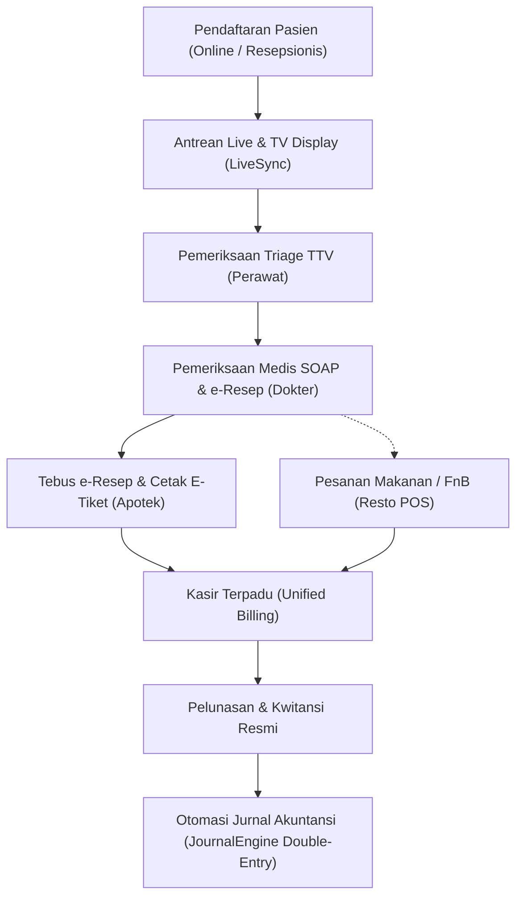

# 🏥 PANDUAN ARSITEKTUR & KEBUTUHAN SISTEM TERINTEGRASI
## SAWAMAWA MEDICAL CENTER ERP

File ini adalah memori permanen dan pedoman komprehensif seluruh modul, database, alur operasional, dan standar teknis sistem ERP **Sawamawa Medical Center**.

---

## 1. 🏗️ Tech Stack & Environment
- **Framework**: CodeIgniter 4 (PHP 8.x)
- **Database**: MySQL / MariaDB via XAMPP Windows (`sawamawa_erp`)
- **Web Server**: Apache XAMPP (`c:\xampp\htdocs\sawamawamedicalcenter.id`)
- **Front-end**: Bootstrap 5, AdminLTE, FontAwesome, DataTables Server-Side Processing, SweetAlert2, Zero-Reload Live Sync via AJAX Polling.
- **Service Layer**: Terletak di `app/Services/` (`ClinicService`, `PharmacyService`, `RestoService`, `JournalEngine`, `FinanceService`, `NotificationService`, `ErrorTrackerService`, `ApprovalEngine`).

---

## 2. 🔄 Alur Bisnis Terintegrasi End-to-End



### Penjelasan Tahapan:
1. **Registrasi Pasien**:
   - Pasien mendaftar via `/daftar-online` (mandiri) atau `/klinik/pendaftaran` (admin).
   - Menghasilkan nomor rekam medis (`no_rm`), nomor kunjungan (`no_visit`), dan nomor antrean di tabel `patient_visits` dan `queue_numbers`.
2. **Triage Perawat & SOAP Dokter**:
   - Perawat menginput TTV (Tensi, Suhu, Nadi, Berat, Tinggi) di tabel `triage_records`.
   - Dokter memeriksa pasien di `/klinik/soap`, mengisi Subjective, Objective, Assessment, Plan (SOAP), memilih diagnosa ICD-10 & prosedur ICD-9-CM, serta meresepkan obat (e-Resep) di tabel `prescriptions` dan `prescription_items`.
3. **Farmasi & Apotek**:
   - Apoteker membuka `/apotek/resep`, memverifikasi item obat yang diserahkan dari internal/luar/batal.
   - Pemotongan stok otomatis mengikuti aturan **FEFO** (*First Expired First Out*) dari tabel `medicine_batches` dan dicatat di `medicine_stock_mutations`.
   - Menghasilkan E-Tiket Label obat siap cetak dan meneruskan invoice ke kasir.
4. **Resto / FnB Terpadu**:
   - Pesanan dari `/resto` dapat dipesan oleh pasien/pengunjung dan ditautkan ke ID kunjungan pasien (`visit_id`) untuk *integrated billing*.
5. **Kasir Terpadu (Unified Billing)**:
   - Kasir di `/keuangan/kasir` otomatis menerima akumulasi seluruh tagihan: **Jasa Medis + Tindakan + Obat Farmasi + Resto POS**.
   - Mendukung multi metode pembayaran (Tunai, QRIS, Debit/Kredit, Transfer).
   - Penerbitan invoice lunas dan cetak kwitansi resmi di tabel `invoices`, `payments`, dan `billing_items`.
6. **Otomasi Jurnal Akuntansi**:
   - Saat status invoice menjadi `paid` atau transaksi modul terkait selesai, `JournalEngine` otomatis membentuk entri jurnal umum debit/kredit di tabel `journal_entries` dan `journal_items` menggunakan template dinamis di `journal_categories` dan `journal_category_rules`.
   - **Aturan lengkap, formula alokasi, multi-tier split, dan daftar pemicu sistem**: lihat panduan khusus di [aturan_jurnal_dan_akuntansi.md](file:///c:/xampp/htdocs/sawamawamedicalcenter.id/.agents/rules/aturan_jurnal_dan_akuntansi.md).

---

## 3. 🗄️ Struktur Tabel Database Inti (`sawamawa_erp`)

| Kategori | Tabel-Tabel Utama | Keterangan & Relasi |
| :--- | :--- | :--- |
| **Klinik & Pasien** | `patients`, `patient_visits`, `queue_numbers`, `triage_records`, `medical_records`, `polikliniks`, `doctors`, `tindakan` | Menyimpan data demografi pasien, kunjungan, antrean live, rekam medis SOAP, master dokter, poli, dan tindakan medis. |
| **Farmasi & Stok** | `medicines`, `medicine_batches`, `prescriptions`, `prescription_items`, `medicine_stock_mutations`, `stock_opnames`, `stock_opname_items`, `medicine_sales`, `medicine_sale_items` | Mengelola data obat, multi-batch expired date (FEFO), tebus e-resep, penjualan obat bebas, mutasi stok, dan stock opname fisik. |
| **Resto POS** | `resto_menus`, `resto_categories`, `resto_orders`, `resto_order_items`, `resto_tables` | Mengelola menu makanan/minuman, pesanan meja/takeaway, dan tagihan resto. |
| **Keuangan & Kasir** | `invoices`, `billing_items`, `payments`, `payment_methods`, `doctor_commissions` | Menggabungkan seluruh komponen tagihan, pembayaran kasir, kwitansi, dan bagi hasil komisi tindakan dokter. |
| **Akuntansi & GL** | `accounts` (COA), `journal_entries`, `journal_items`, `journal_categories`, `journal_category_rules`, `fiscal_periods`, `budget_plans` | Chart of Accounts, pembukuan double-entry, aturan template jurnal, buku besar, neraca saldo, laba rugi, dan neraca (Detail: [aturan_jurnal_dan_akuntansi.md](file:///c:/xampp/htdocs/sawamawamedicalcenter.id/.agents/rules/aturan_jurnal_dan_akuntansi.md)). |
| **Procurement & Aset**| `suppliers`, `purchase_requisitions`, `purchase_orders`, `po_items`, `inventory_items`, `asset_locations` | Pengadaan obat/barang, vendor, approval pengadaan, inventaris aset. |
| **SDM & HRD** | `employees`, `departments`, `positions`, `attendances`, `payrolls`, `payroll_items` | Manajemen pegawai, absensi, slip gaji, tunjangan, dan potongan. |
| **Sistem & Audit** | `users`, `roles`, `permissions`, `audit_logs`, `notifications`, `system_errors`, `performance_metrics` | Autentikasi RBAC, tracking error/performa, dan log aktivitas pengguna. |

---

## 4. ⚡ Live Sync & Real-Time Polling Architecture
- Endpoint sentral: [`app/Controllers/LiveSync.php`](file:///c:/xampp/htdocs/sawamawamedicalcenter.id/app/Controllers/LiveSync.php)
- Method:
  - `klinikQueue()`: Live update antrean poli, panggilan dokter, status triage.
  - `pharmacyPrescriptions()`: Live update antrean resep masuk apotek.
  - `cashierBills()`: Live update antrean tagihan kasir.
  - `restoOrders()`: Live update pesanan dapur resto.
  - `notificationFeeds()`: Real-time alert dan notifikasi internal staf.
- Front-end menggunakan AJAX polling cerdas (interval 3-5 detik) dengan mekanisme pengecekan timestamp/status untuk mencegah overhead server.

---

## 5. 🛠️ Standar Pengembangan & Panduan AI
1. **Database & Transaksi**:
   - Selalu gunakan `$db->transBegin()`, `$db->transCommit()`, `$db->transRollback()` untuk operasi multi-tabel (misal: simpan SOAP + e-Resep, atau Bayar Kasir + Potong Stok + Jurnal).
2. **Error Tracking**:
   - Gunakan `ErrorTrackerService::trackException($e, 'MODULE_NAME')` di blok `catch` untuk mendokumentasikan error runtime.
3. **Format Tanggal & Rupiah**:
   - Mata uang: format standar Rupiah `number_format($amount, 0, ',', '.')`.
   - Tanggal: format lokal Indonesia `d F Y` atau `Y-m-d` untuk database.
4. **DataTables**:
   - Gunakan standar SSP (Server-Side Processing) untuk tabel data bervolume besar (`patients`, `invoices`, `medicines`, `journal_entries`).

---

## 6. 🎙️ Standar Panduan Suara Terpadu (*Unified Voice Guidance*)
1. **Pemicuan Otomatis Multi-Tahap**:
   - **Dokter Selesai SOAP**: Memicu suara *"Pemeriksaan dokter telah selesai, silakan menuju ke Kasir Pembayaran untuk administrasi"*.
   - **Kasir Selesai Lunas**: Memicu suara *"Transaksi pembayaran telah selesai, silakan menuju ke Loket Farmasi dan Apotek untuk pengambilan obat"*.
   - **Apotek Selesai Serah Obat**: Memicu suara *"Penyerahan obat telah selesai. Terima kasih banyak atas kunjungan Anda, semoga lekas sembuh"*.
2. **Proteksi Overwrite Status di `QueueCallService`**:
   - Pemicuan suara arah kasir menyetel `pv.status = 'cashier'`, farmasi menyetel `pv.status = 'prescription'`, dan serah obat menyetel `pv.status = 'completed'`. Dilarang menimpa kembali status menjadi `examining` atau `called`.
3. **Display TV Antrean (`/klinik/display`)**:
   - Memantau event siar antrean pusat secara berurutan (*FIFO*) melalui `window.VCM.startServerPolling(2000)` dengan jeda hening *anti-collision* 850ms. Filter ketat pasien selesai agar layar TV selalu bersih dan menampilkan antrean aktif.

---

## 7. 🧭 Standar Desain UI/UX: Modul Header Quickbar & Zero-Reload SPA Navigator

Pedoman ini wajib diterapkan saat menyederhanakan dan merapikan modul sistem (Pelayanan Klinik, Farmasi & Apotek, Kasir, Resto, HRD, dll):

### A. Pola Navigasi Header Quick Touch Bar (Modul Konsolidasi)
1. **Sidebar Collapsed by Default**:
   - Body layout menggunakan class `sidebar-mini sidebar-collapse` agar ruang kerja horizontal selalu 100% lapang.
2. **Sub-Menu Berpindah ke Navbar Header**:
   - Sub-menu utama tiap domain dipindahkan ke toolbar header dengan class `.navbar-clinical-quickbar` dan `.btn-clinical-nav`.
   - Menggunakan ikon yang jelas + teks singkat responsif (`<span class="d-none d-sm-inline">Label</span>`).
   - **Dilarang** menyematkan atribut `title="..."` pada tombol navbar untuk mencegah munculnya tulisan melayang (*floating tooltip popup*).
3. **Penyatuan Status Jaringan & Draf**:
   - Indikator koneksi internet dan tombol antrean draf offline digabungkan menjadi 1 tombol *pill* terpadu (`#navbar-network-status`).
4. **Profil Bundar Minimalis**:
   - Profil pengguna di header dibuat dalam bentuk avatar/inisial bundar murni tanpa teks nama panjang.

### B. Aturan Mesin Zero-Reload SPA Navigator (`window.navigateSpa`)
1. **Pencegahan Error Reinitialise DataTables**:
   - Sebelum inisialisasi tabel, selalu sertakan guard:
     ```javascript
     if ($.fn.DataTable.isDataTable('#table-id')) {
         $('#table-id').DataTable().destroy();
     }
     ```
   - Tambahkan opsi `destroy: true` pada inisialisasi DataTables Server-Side.
   - Atur `$.fn.dataTable.ext.errMode = 'none'` di layout utama untuk meredam popup alert.
2. **Pembersihan Bersih Saat Navigasi**:
   - Fungsi `navigateSpa()` wajib mendestroy seluruh `.dataTable` aktif, membersihkan modal backdrop, dan menutup select dropdown sebelum menukar elemen `.content-wrapper`.
3. **Penanda Tombol Aktif & Sinkronisasi URL**:
   - Update URL secara dinamis via `window.history.pushState` dan aktifkan penanda tombol hijau (`btn-teal text-white`) pada toolbar header yang sesuai dengan URL aktif.

### C. Daftar 9 Modul Quick Touch Bar Header
1. **Pelayanan Klinik** (`#quickbar-klinik`): `Pendaftaran`, `RME SOAP`, `Surat`, `Lab`, `Laporan`, `TV Display ↗`, `Kiosk ↗`
2. **Farmasi & Apotek** (`#quickbar-apotek`): `E-Resep`, `Stok & FEFO`, `Gudang`, `Kartu Stok`, `Opname`, `Laporan`, `Kasir OTC`
3. **Resto & Nutrisi** (`#quickbar-resto`): `Kasir POS`, `Dapur Gizi (KDS)`, `Laporan Resto`, `Display TV Resto ↗`
4. **Keuangan & Kasir** (`#quickbar-keuangan`): `Kasir Utama`, `Rekap Shift`, `Kas & Bank`, `Aging Piutang`, `Jasa Dokter`
5. **Akuntansi & Laporan** (`#quickbar-accounting`): `Jurnal Umum`, `Buku Besar`, `Lap. Keuangan`, `Bagan Akun (COA)`, `Saldo Awal`
6. **Pengadaan & Approval** (`#quickbar-procurement`): `Pengadaan (PO)`, `Persetujuan Request`
7. **Aset & HRD Kepegawaian** (`#quickbar-hrd`): `Inventaris Aset`, `Data Pegawai`, `Presensi`, `Matriks KPI`
8. **Master Data Referensi** (`#quickbar-master`): `Layanan & Dokter`, `Diagnosa ICD`, `Metode Bayar`
9. **Administrasi Sistem** (`#quickbar-system`): `Pengguna (RBAC)`, `Notifikasi`, `Database`, `WhatsApp`, `Error Tracker`, `Performa`, `Audit Log`, `Artikel`, `Pengaturan`
