# 📋 DOKUMENTASI TEKNIS LENGKAP SISTEM INFORMASI MANAJEMEN KLINIK

## SAWAMAWA MEDICAL CENTER & RESTO GIZI — Enterprise Resource Planning (ERP)

> **Versi Sistem:** v3.7.0 (Build 30 Agustus 2026)
> **Framework:** CodeIgniter 4 (PHP 8.x) · MySQL 8.0 · AdminLTE 3.2
> **Database:** `sawamawa_erp` — 101 Tabel Terintegrasi
> **Lisensi:** Proprietary — Hak Cipta Dilindungi

---

## DAFTAR ISI

1. [Ringkasan Eksekutif](#1-ringkasan-eksekutif)
2. [Arsitektur Sistem](#2-arsitektur-sistem)
3. [Teknologi & Dependensi](#3-teknologi--dependensi)
4. [Struktur Direktori Proyek](#4-struktur-direktori-proyek)
5. [Skema Database (101 Tabel)](#5-skema-database-101-tabel)
6. [Modul Sistem & Fitur Lengkap](#6-modul-sistem--fitur-lengkap)
7. [Alur Bisnis Utama (Business Flow)](#7-alur-bisnis-utama-business-flow)
8. [API Layer & Interoperabilitas](#8-api-layer--interoperabilitas)
9. [Service Engine Layer](#9-service-engine-layer)
10. [Sistem Keamanan & Otorisasi](#10-sistem-keamanan--otorisasi)
11. [Sistem Notifikasi & Real-Time](#11-sistem-notifikasi--real-time)
12. [Peta Rute (Route Map)](#12-peta-rute-route-map)
13. [Diagram Alur Sistem (Flowchart)](#13-diagram-alur-sistem-flowchart)
14. [Panduan Deployment & Konfigurasi](#14-panduan-deployment--konfigurasi)
15. [Changelog & Riwayat Versi](#15-changelog--riwayat-versi)

---

## 1. Ringkasan Eksekutif

**Sawamawa Medical Center ERP** adalah sistem informasi manajemen klinik terintegrasi penuh (*end-to-end*) yang mendigitalisasi seluruh proses operasional fasilitas kesehatan tingkat pertama (FKTP), mulai dari **pendaftaran pasien**, **rekam medis elektronik (RME)**, **farmasi & apotek multi-gudang**, **keuangan & kasir**, **akuntansi double-entry**, **pengadaan barang**, **restoran gizi**, **kepegawaian & payroll**, hingga **inventaris aset** — dalam satu platform web terpadu.

### Keunggulan Utama

| Fitur | Deskripsi |
|---|---|
| 🏥 **Klinik Digital Penuh** | Pendaftaran → Triase → SOAP → e-Resep → Laboratorium → Billing → Penyerahan Obat |
| 💊 **Farmasi Multi-Gudang** | Gudang Induk Logistik + Depo Apotek Pelayanan + Mutasi Transfer Otomatis |
| 💰 **Akuntansi Double-Entry** | Chart of Accounts (COA) → Jurnal Otomatis → Buku Besar → Laporan Keuangan (Neraca, Laba Rugi, Arus Kas) |
| 📡 **Real-Time LiveSync** | Zero-Reload JSON Polling untuk Antrean, Resep, Kasir, Dapur, dan Lab |
| 🔊 **Voice Calling System** | Text-to-Speech Anti-Collision dengan Web Speech API (Indonesia) |
| 📺 **Multi-Display** | Display TV Antrean Klinik + Display TV Resto + Kiosk Mandiri APM |
| 🍽️ **POS Restoran Gizi** | Order → Kitchen Display System (KDS) → Penyajian + Integrasi Diet Pasien |
| 📊 **Dashboard Eksekutif** | KPI Real-Time, Grafik 7 Hari, dan Kartu Metrik Keuangan |
| 🔐 **RBAC Granular** | 16 Role + 75+ Permission + Audit Trail Komprehensif |
| 🏗️ **Pengadaan & Approval** | PR → PO → GRN dengan Multi-Level Approval Workflow |
| 📱 **SATUSEHAT Ready** | Endpoint FHIR R4 Encounter untuk Integrasi Kemenkes RI |
| 🎨 **Multi-Theme Engine** | Paper White · macOS Big Sur · Modern Emerald · Windows XP Klasik |

---

## 2. Arsitektur Sistem

### 2.1 Arsitektur Tingkat Tinggi (High-Level Architecture)

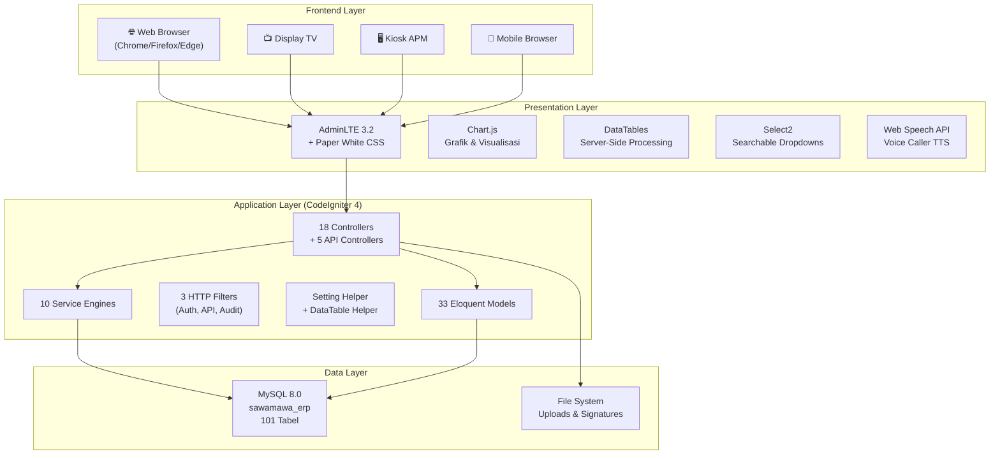

### 2.2 Pola Desain (Design Patterns)

| Pattern | Implementasi |
|---|---|
| **MVC** | Controllers → Views → Models (CodeIgniter 4 native) |
| **Service Layer** | `PharmacyService`, `JournalEngine`, `QueueCallService`, dll. |
| **Repository Pattern** | 33 Model classes sebagai data access abstraction |
| **Observer/Event** | `Events::trigger()` untuk notifikasi cross-module |
| **Strategy Pattern** | `JournalEngine` — dinamis memilih akun debit berdasarkan metode pembayaran |
| **Template Method** | `ApprovalEngine` — multi-step approval configurable |
| **Singleton** | Database connection via `\Config\Database::connect()` |

---

## 3. Teknologi & Dependensi

### 3.1 Backend Stack

| Komponen | Teknologi | Versi |
|---|---|---|
| Framework | CodeIgniter 4 | 4.x |
| Bahasa | PHP | 8.x |
| Database | MySQL | 8.0 |
| Web Server | Apache (XAMPP) | 2.4.x |
| Package Manager | Composer | 2.x |

### 3.2 Frontend Stack

| Komponen | Teknologi | Versi |
|---|---|---|
| Admin Template | AdminLTE | 3.2.0 |
| CSS Framework | Bootstrap | 4.6.x |
| JavaScript | jQuery | 3.6.4 |
| Tabel Interaktif | DataTables | 1.10.21 |
| Dropdown Pencarian | Select2 | 4.0.13 |
| Grafik & Chart | Chart.js | Latest |
| Ikon | Font Awesome | 6.4.0 |
| Font | Source Sans Pro | Google Fonts |

### 3.3 Fitur Browser Native

| Fitur | API |
|---|---|
| Text-to-Speech | Web Speech API (`SpeechSynthesisUtterance`) |
| Audio Chime | Web Audio API (Oscillator + Gain) |
| Theme Persistence | `localStorage` |
| Offline Detection | `navigator.onLine` + Network Status Indicator |

---

## 4. Struktur Direktori Proyek

```
sawamawamedicalcenter.id/
├── app/
│   ├── Commands/              # CLI commands (Spark)
│   ├── Config/
│   │   ├── Routes.php         # 279 baris rute (Public + Auth + API + LiveSync)
│   │   ├── Filters.php        # HTTP filter bindings
│   │   └── ...
│   ├── Controllers/
│   │   ├── Accounting.php     # Akuntansi & Laporan Keuangan (COA, Jurnal, Buku Besar)
│   │   ├── Apotek.php         # Farmasi, Stok, Gudang Multi-Depo, Opname, Resep
│   │   ├── Auth.php           # Login, Logout, Session Management
│   │   ├── Dashboard.php      # Executive Dashboard KPI & Metrics
│   │   ├── Help.php           # Pusat Bantuan & Dokumentasi Interaktif
│   │   ├── Home.php           # Landing Page Publik & Pendaftaran Online
│   │   ├── HRD.php            # Kepegawaian, Payroll, Absensi, Cuti, KPI
│   │   ├── Inventaris.php     # Manajemen Aset, Depresiasi, Mutasi
│   │   ├── Keuangan.php       # Kasir Utama, Kas & Bank, Aging, Fee Dokter
│   │   ├── Klinik.php         # Pendaftaran, SOAP/RME, Surat, Lab, Laporan
│   │   ├── LiveSync.php       # Real-Time JSON Sync Engine (6 Channel)
│   │   ├── MasterIcd.php      # Master ICD-10 & ICD-9 CM
│   │   ├── MasterKlinik.php   # Master Poliklinik, Dokter, Tindakan, Ruangan, dll.
│   │   ├── MasterPembayaran.php # Master Metode Pembayaran
│   │   ├── Procurement.php    # Pengadaan: PR → PO → GRN + Supplier + Approval
│   │   ├── Resto.php          # POS Restoran, KDS Dapur, Display Antrean Resto
│   │   ├── System.php         # Admin: Users, Settings, Backup, Error Logs, Audit
│   │   └── Api/
│   │       ├── AntreanController.php    # REST API Antrean
│   │       ├── BaseApiController.php    # Base class API
│   │       ├── MedicineController.php   # REST API Katalog Obat
│   │       ├── PatientController.php    # REST API Pasien
│   │       └── SatuSehatController.php  # FHIR R4 Interoperability
│   ├── Filters/
│   │   ├── AuthFilter.php          # Session-based Authentication Guard
│   │   ├── ApiKeyFilter.php        # API Key Validation (X-API-Key)
│   │   └── AuditTrailFilter.php    # Automatic HTTP Request Logger
│   ├── Helpers/
│   │   └── setting_helper.php      # clinic_setting(), clinic_logo(), datatable_server_side()
│   ├── Models/                     # 33 Eloquent-style ORM Models
│   ├── Services/
│   │   ├── ApprovalEngine.php      # Multi-Level Approval Workflow
│   │   ├── AuditService.php        # Audit Trail Logger
│   │   ├── ClinicService.php       # Clinic Business Logic (Visit, Queue, Triage)
│   │   ├── ErrorTrackerService.php # Centralized Error Deduplication & Tracking
│   │   ├── FinanceService.php      # Financial Calculations
│   │   ├── JournalEngine.php       # Double-Entry Accounting Auto-Journal
│   │   ├── NotificationService.php # Push Notification Engine + Rules
│   │   ├── PharmacyService.php     # Prescription Dispensing & OTC Sale + Multi-Warehouse Sync
│   │   ├── QueueCallService.php    # Voice Call Anti-Collision Queue Engine
│   │   └── RestoService.php        # Restaurant Order, KDS, & Diet Integration
│   ├── Views/
│   │   ├── accounting/    # 6 views (COA, Jurnal, Buku Besar, Laporan, Saldo Awal, Cetak)
│   │   ├── apotek/        # 12 views (Stok, Resep, Gudang, POS, Opname, Kartu Stok, Laporan, Cetak)
│   │   ├── auth/          # Login page
│   │   ├── dashboard/     # Executive Dashboard
│   │   ├── help/          # Pusat Bantuan Interaktif
│   │   ├── hrd/           # 6 views (Pegawai, Absensi, KPI, Slip Gaji, Rekap)
│   │   ├── inventaris/    # 3 views (Aset, Label, Laporan)
│   │   ├── keuangan/      # 7 views (Kasir, Transaksi, Rekap, Aging, Fee Dokter, Kwitansi)
│   │   ├── klinik/        # 16 views (Pendaftaran, SOAP, Surat, Lab, Display, Kiosk, Laporan, dll.)
│   │   ├── layouts/       # Master Layout (1786 baris), Sidebar, Navbar, Footer, LiveSync Engine
│   │   ├── master/        # Master Data views
│   │   ├── procurement/   # 5 views (PO, PR, GRN, Approval, Cetak)
│   │   ├── public/        # Landing Page, Pendaftaran Online, Berita
│   │   ├── resto/         # 6 views (POS, Dapur KDS, Display TV, Laporan, Cetak)
│   │   └── system/        # 13 views (Users, Settings, Audit, Error, WhatsApp, Notifikasi, dll.)
│   └── Libraries/
├── database/
│   └── dumps/             # SQL Backup Dumps
├── docs/
│   └── proposals/         # Dokumen Referensi (PDF)
├── public/
│   ├── assets/
│   │   ├── css/custom.css # Paper White Design System
│   │   ├── js/            # JavaScript modules
│   │   └── uploads/       # User uploads (photos, signatures, media)
│   ├── index.php          # Entry point
│   └── .htaccess          # URL Rewrite Rules
├── .env                   # Environment Configuration
├── composer.json          # PHP Dependencies
└── README.md
```

---

## 5. Skema Database (101 Tabel)

### 5.1 Peta Relasi Tabel per Modul

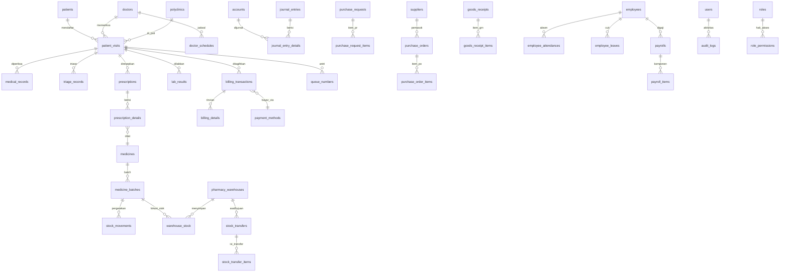

### 5.2 Daftar 101 Tabel (Dikelompokkan per Domain)

#### 🏥 Modul Klinik & Rekam Medis (16 tabel)

| # | Tabel | Deskripsi | Kolom Kunci |
|---|---|---|---|
| 1 | `patients` | Master data pasien | `id`, `no_rm`, `nik`, `name`, `phone`, `membership_tier` |
| 2 | `patient_visits` | Kunjungan pasien | `id`, `no_visit`, `patient_id`, `doctor_id`, `polyclinic_id`, `status` |
| 3 | `medical_records` | Rekam medis SOAP | `id`, `visit_id`, `subjective`, `objective`, `assessment`, `plan` |
| 4 | `triage_records` | Triase perawat | `id`, `visit_id`, `nurse_id`, `blood_pressure`, `temperature` |
| 5 | `queue_numbers` | Nomor antrean | `id`, `visit_id`, `queue_type`, `queue_number`, `status` |
| 6 | `queue_call_events` | Event panggilan suara | `id`, `service_type`, `queue_number`, `voice_text`, `status` |
| 7 | `lab_results` | Hasil laboratorium | `id`, `visit_id`, `lab_test_id`, `result_value`, `status` |
| 8 | `lab_tests` | Master pemeriksaan lab | `id`, `code`, `name`, `category`, `normal_range` |
| 9 | `medical_letters` | Surat medis & rujukan | `id`, `visit_id`, `letter_type`, `content` |
| 10 | `medical_informed_consents` | Informed consent | `id`, `visit_id`, `procedure_name`, `consent_text` |
| 11 | `medical_photos` | Foto klinis | `id`, `visit_id`, `photo_path`, `caption` |
| 12 | `odontograms` | Odontogram gigi | `id`, `patient_id`, `tooth_data` (JSON) |
| 13 | `polyclinics` / `polikliniks` | Master poliklinik | `id`, `code`, `name`, `status` |
| 14 | `doctors` | Master dokter | `id`, `name`, `specialization`, `sip_number` |
| 15 | `doctor_schedules` | Jadwal praktek | `id`, `doctor_id`, `polyclinic_id`, `day`, `start_time`, `end_time` |
| 16 | `nurses` | Master perawat | `id`, `name`, `nik` |

#### 💊 Modul Farmasi & Apotek (15 tabel)

| # | Tabel | Deskripsi | Kolom Kunci |
|---|---|---|---|
| 17 | `medicines` | Master obat | `id`, `code`, `name`, `type`, `unit`, `price`, `min_stock` |
| 18 | `medicine_batches` | Batch obat per lot | `id`, `medicine_id`, `batch_no`, `buy_price`, `stock`, `expired_date` |
| 19 | `medicine_categories` | Kategori/golongan obat | `id`, `name` |
| 20 | `prescriptions` | Header e-resep | `id`, `visit_id`, `doctor_id`, `status`, `dispensed_at` |
| 21 | `prescription_details` | Item resep | `id`, `prescription_id`, `medicine_id`, `qty`, `dosage`, `status` |
| 22 | `pharmacy_sales` | Penjualan OTC non-resep | `id`, `sale_no`, `customer_name`, `grand_total`, `payment_method` |
| 23 | `pharmacy_sale_details` | Item penjualan OTC | `id`, `sale_id`, `medicine_id`, `batch_id`, `qty`, `price` |
| 24 | `stock_movements` | Kartu stok (audit trail) | `id`, `medicine_id`, `batch_id`, `transaction_type`, `qty_in`, `qty_out` |
| 25 | `stock_opnames` | Header stock opname | `id`, `opname_no`, `opname_date`, `status` |
| 26 | `stock_opname_details` | Detail opname per item | `id`, `opname_id`, `medicine_id`, `system_stock`, `physical_stock` |
| 27 | `pharmacy_warehouses` | Master gudang/depo | `id`, `code`, `name`, `type` (main/depo), `address` |
| 28 | `warehouse_stock` | Stok per gudang per batch | `id`, `warehouse_id`, `medicine_id`, `batch_id`, `stock` |
| 29 | `stock_transfers` | Header mutasi antar gudang | `id`, `transfer_no`, `source_warehouse_id`, `target_warehouse_id`, `status` |
| 30 | `stock_transfer_items` | Item mutasi | `id`, `stock_transfer_id`, `medicine_id`, `batch_id`, `qty` |
| 31 | `units` | Master satuan obat | `id`, `code`, `name`, `category` |

#### 💰 Modul Keuangan & Kasir (10 tabel)

| # | Tabel | Deskripsi | Kolom Kunci |
|---|---|---|---|
| 32 | `billing_transactions` | Tagihan kunjungan | `id`, `visit_id`, `total`, `discount`, `grand_total`, `status` |
| 33 | `billing_details` | Rincian tagihan | `id`, `billing_id`, `item_type`, `item_name`, `qty`, `price`, `subtotal` |
| 34 | `cash_registers` | Kas register (shift) | `id`, `opening_balance`, `balance`, `status` (open/closed) |
| 35 | `cash_transactions` | Transaksi kas harian | `id`, `type` (masuk/keluar), `amount`, `category`, `description` |
| 36 | `internal_cash_transfers` | Transfer antar akun kas | `id`, `from_account_id`, `to_account_id`, `amount` |
| 37 | `payment_methods` | Master metode pembayaran | `id`, `name`, `category`, `is_active` |
| 38 | `fee_rules` | Aturan jasa medis dokter | `id`, `doctor_id`, `service_id`, `percentage`, `fixed_amount` |
| 39 | `fee_transactions` | Riwayat jasa medis | `id`, `visit_id`, `doctor_id`, `amount`, `status` |
| 40 | `doctor_fee_settlements` | Settlement jasa medis | `id`, `doctor_id`, `period`, `total_amount`, `paid_at` |
| 41 | `transaction_account_mappings` | Mapping tipe transaksi → akun COA | `id`, `transaction_type`, `debit_account_id`, `credit_account_id` |

#### 📊 Modul Akuntansi Double-Entry (3 tabel)

| # | Tabel | Deskripsi | Kolom Kunci |
|---|---|---|---|
| 42 | `accounts` | Chart of Accounts (COA) | `id`, `code`, `name`, `type` (asset/liability/equity/revenue/expense), `balance` |
| 43 | `journal_entries` | Header jurnal umum | `id`, `journal_no`, `date`, `description`, `source_module`, `reference_id` |
| 44 | `journal_entry_details` | Detail debit/kredit | `id`, `journal_entry_id`, `account_id`, `debit`, `credit` |

#### 🏗️ Modul Pengadaan & Approval (9 tabel)

| # | Tabel | Deskripsi | Kolom Kunci |
|---|---|---|---|
| 45 | `suppliers` | Master pemasok (PBF) | `id`, `code`, `name`, `address`, `phone`, `bank_account` |
| 46 | `purchase_requests` | Permintaan pembelian (PR) | `id`, `pr_no`, `requested_by`, `status` |
| 47 | `purchase_request_items` | Item PR | `id`, `pr_id`, `medicine_id`, `qty`, `notes` |
| 48 | `purchase_orders` | Pesanan pembelian (PO) | `id`, `po_no`, `supplier_id`, `pr_id`, `status` |
| 49 | `purchase_order_items` | Item PO | `id`, `po_id`, `medicine_id`, `qty`, `price` |
| 50 | `goods_receipts` | Penerimaan barang (GRN) | `id`, `grn_no`, `po_id`, `received_by`, `received_at` |
| 51 | `goods_receipt_items` | Item GRN | `id`, `goods_receipt_id`, `medicine_id`, `batch_id`, `qty_received` |
| 52 | `approval_workflows` | Konfigurasi workflow | `id`, `transaction_type`, `total_steps` |
| 53 | `approval_requests` | Request persetujuan | `id`, `transaction_type`, `reference_id`, `step_level`, `status` |
| 54 | `approval_steps` | Definisi step approval | `id`, `workflow_id`, `step_level`, `approver_role` |

#### 🍽️ Modul Restoran Gizi (5 tabel)

| # | Tabel | Deskripsi | Kolom Kunci |
|---|---|---|---|
| 55 | `restaurant_menus` | Katalog menu & produk nutrisi | `id`, `name`, `category`, `price`, `stock`, `is_available` |
| 56 | `restaurant_orders` | Header order restoran | `id`, `order_no`, `order_type` (umum/diet_pasien), `status` |
| 57 | `restaurant_order_details` | Item order | `id`, `order_id`, `menu_id`, `qty`, `subtotal` |
| 58 | `restaurant_tables` | Master meja restoran | `id`, `table_no`, `capacity`, `status` |
| 59 | `kitchen_orders` | Antrean dapur (KDS) | `id`, `order_id`, `status` (queued/cooking/ready) |

#### 👥 Modul HRD & Kepegawaian (7 tabel)

| # | Tabel | Deskripsi | Kolom Kunci |
|---|---|---|---|
| 60 | `employees` | Data pegawai | `id`, `employee_no`, `name`, `department_id`, `job_position_id` |
| 61 | `employee_attendances` | Presensi harian | `id`, `employee_id`, `date`, `check_in`, `check_out`, `shift_id` |
| 62 | `employee_leaves` | Pengajuan cuti | `id`, `employee_id`, `leave_type`, `start_date`, `end_date`, `status` |
| 63 | `payrolls` | Header payroll bulanan | `id`, `employee_id`, `period`, `gross_salary`, `net_salary`, `status` |
| 64 | `payroll_items` | Komponen gaji | `id`, `payroll_id`, `item_name`, `type` (allowance/deduction), `amount` |
| 65 | `work_shifts` | Master shift kerja | `id`, `shift_code`, `shift_name`, `start_time`, `end_time` |
| 66 | `departments` | Master departemen | `id`, `name`, `code` |
| 67 | `job_positions` | Master jabatan | `id`, `name`, `department_id` |

#### 📦 Modul Inventaris Aset (3 tabel)

| # | Tabel | Deskripsi | Kolom Kunci |
|---|---|---|---|
| 68 | `inventory_assets` | Master aset tetap | `id`, `asset_code`, `name`, `category`, `purchase_price`, `location` |
| 69 | `asset_depreciations` | Penyusutan aset | `id`, `asset_id`, `period`, `depreciation_amount`, `book_value` |
| 70 | `asset_maintenances` | Riwayat servis/pemeliharaan | `id`, `asset_id`, `maintenance_date`, `cost`, `description` |
| 71 | `asset_mutations` | Mutasi/perpindahan aset | `id`, `asset_id`, `from_location`, `to_location`, `date` |

#### ⚙️ Modul Sistem & Administrasi (18 tabel)

| # | Tabel | Deskripsi | Kolom Kunci |
|---|---|---|---|
| 72 | `users` | Akun pengguna sistem | `id`, `username`, `fullname`, `role_id`, `digital_signature` |
| 73 | `roles` | Role/jabatan sistem | `id`, `name`, `description` |
| 74 | `permissions` | Daftar hak akses | `id`, `name`, `description` |
| 75 | `role_permissions` | Relasi role ↔ permission | `role_id`, `permission_id` |
| 76 | `user_permissions` | Override permission user | `user_id`, `permission_id` |
| 77 | `audit_logs` | Log audit aktivitas | `id`, `user_id`, `action`, `url`, `method`, `ip_address` |
| 78 | `system_settings` | Konfigurasi global sistem | `id`, `setting_group`, `setting_key`, `setting_value` |
| 79 | `system_notifications` | Notifikasi operasional | `id`, `notification_key`, `category`, `title`, `message`, `target_roles` |
| 80 | `system_notification_reads` | Read receipts notifikasi | `id`, `notification_id`, `user_id`, `read_at` |
| 81 | `notification_rules` | Aturan notifikasi otomatis | `id`, `rule_code`, `rule_name`, `category`, `is_active` |
| 82 | `system_updates` | Riwayat pembaruan versi | `id`, `version`, `title`, `category`, `release_date` |
| 83 | `system_documentations` | Pusat bantuan & alur kerja | `id`, `category`, `title`, `flow_steps`, `content` |
| 84 | `system_error_logs` | Error tracker (deduplicated) | `id`, `error_hash`, `error_level`, `message`, `file`, `count` |
| 85 | `system_slow_queries` | Monitor query lambat | `id`, `query_sql`, `execution_time_ms`, `caller_location` |
| 86 | `whatsapp_logs` | Log WhatsApp gateway | `id`, `recipient_phone`, `message_type`, `status` |
| 87 | `articles` | Artikel & berita publik | `id`, `title`, `slug`, `content`, `status` |
| 88 | `migrations` | Migrasi database CI4 | `id`, `version`, `class`, `group`, `batch` |

#### 🏥 Modul Master Data Referensi (13 tabel)

| # | Tabel | Deskripsi |
|---|---|---|
| 89 | `categories` | Kategori umum (tindakan, layanan) |
| 90 | `consent_templates` | Template informed consent |
| 91 | `icd10_diagnoses` | Kustom ICD-10 diagnosa |
| 92 | `icd9_procedures` | Kustom ICD-9 CM prosedur |
| 93 | `master_icd10` | Master ICD-10 lengkap |
| 94 | `master_icd9` | Master ICD-9 CM lengkap |
| 95 | `insurance_providers` | Master asuransi/BPJS |
| 96 | `services` | Master layanan medis |
| 97 | `service_prices` | Tarif layanan |
| 98 | `tindakan` | Master tindakan medis |
| 99 | `rooms` | Master ruangan |
| 100 | `beds` | Master tempat tidur |
| 101 | `#` | *Total: 101 tabel* |

---

## 6. Modul Sistem & Fitur Lengkap

### 6.1 🏥 Modul Pelayanan Klinik

#### Pendaftaran Pasien (`Klinik::pendaftaran`)
- Pendaftaran pasien baru + kunjungan ulang
- Auto-generate No. RM (format `RM-XXXXXX`)
- Auto-generate No. Kunjungan (format `VST-YYYYMMDD-XXXX`)
- Auto-generate Nomor Antrean (format `A-001`, `B-001` per poli)
- Integrasi data asuransi (BPJS / Umum / Asuransi Swasta)
- Membership tier pasien (Regular / Silver / Gold / Platinum)
- Toggle buka/tutup pendaftaran online

#### Pendaftaran Online & Kiosk Mandiri (`Home::daftarOnline`, `Klinik::kiosk`)
- Formulir pendaftaran publik (tanpa login)
- Pengecekan pasien lama berdasarkan NIK/No.RM/Telepon
- Kiosk mandiri (APM) — fullscreen, responsif, tanpa keyboard fisik
- Cetak kartu antrean virtual

#### Display Antrean TV (`Klinik::display`)
- Layar penuh multi-loket per poliklinik
- Auto-refresh real-time via LiveSync
- Voice calling TTS Bahasa Indonesia
- Chime audio (hospital 2-tone, ding-dong, bell)
- Integrasi media slider (gambar/video promosi)
- Konfigurasi voice (gender, rate, pitch, volume)

#### Rekam Medis Elektronik / SOAP (`Klinik::soap`)
- Formulir SOAP terstruktur (Subjective, Objective, Assessment, Plan)
- Pencarian ICD-10 & ICD-9 CM dengan autocomplete
- Input vital signs (tekanan darah, suhu, nadi, respirasi, BB, TB)
- e-Resep terintegrasi langsung dari SOAP
- Input tindakan medis dan perhitungan tarif
- Upload foto klinis (before/after)
- Odontogram digital interaktif (gigi)
- Informed consent digital (template + tanda tangan)
- Cetak ringkasan RME komprehensif
- Riwayat kunjungan pasien (timeline)
- Auto-billing saat selesai pemeriksaan

#### Laboratorium (`Klinik::lab`)
- Permintaan pemeriksaan lab dari SOAP
- Input hasil lab dengan referensi normal range
- Status: diminta → diproses → selesai
- Cetak hasil laboratorium (PDF)

#### Surat Medis & Rujukan (`Klinik::surat`)
- Surat Keterangan Sakit / Sehat
- Surat Rujukan ke RS / Spesialis
- Template surat dinamis
- Cetak surat resmi dengan header klinik

#### Laporan Pelayanan (`Klinik::laporan`)
- Laporan kunjungan harian/bulanan
- Statistik diagnosa terbanyak (ICD-10)
- Statistik tindakan terbanyak (ICD-9)
- Grafik tren kunjungan 7 hari
- Export data pasien ke Excel
- Cetak laporan (PDF)

---

### 6.2 💊 Modul Farmasi & Apotek

#### Penjualan Obat Bebas / OTC (`Apotek::penjualan`)
- POS kasir apotek untuk penjualan langsung (walk-in)
- Pencarian obat dengan autocomplete
- Pemilihan batch otomatis (FEFO — First Expired First Out)
- Diskon per item
- Multi metode pembayaran (Tunai, QRIS, Transfer, EDC)
- Cetak nota penjualan (struk)
- Integrasi jurnal akuntansi otomatis
- Sinkronisasi stok ke Depo Apotek

#### Tebus e-Resep (`Apotek::resep`)
- Daftar e-resep dari dokter (real-time LiveSync)
- Pilih batch obat per item resep
- Opsi: Internal (dari stok) / Beli di Luar / Cancel
- Diskon per item obat
- Validasi: harus lunas di kasir terlebih dahulu
- Penyerahan obat + update status kunjungan
- Cetak etiket obat
- Notifikasi otomatis ke role terkait

#### Stok & Kedaluwarsa (`Apotek::stok`)
- Master obat (CRUD): kode, nama, golongan, unit, harga jual, stok minimum
- Manajemen batch: nomor batch, harga beli, stok, tanggal kadaluarsa
- Alert visual stok kritis (merah) vs aman (hijau)
- DataTables server-side processing
- Tambah/Edit/Hapus batch

#### Gudang & Multi-Depo (`Apotek::gudang`)
- Daftar gudang/depo aktif (Gudang Induk, Depo RJ, Depo UGD, Depo RI)
- Stok per gudang per obat per batch (real-time)
- **Transfer mutasi antar gudang:**
  - Pilih gudang asal dan tujuan
  - Pilih obat + batch + kuantitas
  - Validasi stok gudang asal
  - Auto-generate nomor surat mutasi (`TRF-YYYYMMDD-XXXX`)
  - Cetak surat jalan mutasi (PDF)
  - Otomatis kurangi stok asal, tambah stok tujuan

#### Kartu Stok Obat (`Apotek::kartuStok`)
- Riwayat pergerakan stok per obat
- Filter berdasarkan tipe transaksi (pembelian, resep, penjualan, retur, adjustment, opname)
- Saldo berjalan (running balance)

#### Stock Opname (`Apotek::opname`)
- Buat sesi opname baru
- Input stok fisik per batch
- Hitung selisih otomatis (sistem vs fisik)
- Adjustment otomatis setelah finalisasi
- Cetak laporan opname (PDF)

#### Laporan Farmasi (`Apotek::laporan`)
- Laporan pemakaian & penjualan obat per periode
- Laporan monitoring kadaluarsa
- Laporan stok obat terkini
- Cetak laporan (PDF)

---

### 6.3 🍽️ Modul Restoran Gizi & Nutrisi

#### Kasir Resto / POS (`Resto::pos`)
- Katalog menu + produk nutrisi dengan gambar
- Keranjang belanja dinamis
- Pilih meja atau takeaway
- **Integrasi diet pasien:** auto-load instruksi diet dari rekam medis
- Diskon dan catatan khusus
- Multi metode pembayaran
- Auto-jurnal akuntansi
- Cetak nota restoran (struk)

#### Kitchen Display System / Dapur (`Resto::dapur`)
- Antrean pesanan masuk real-time (LiveSync)
- Status: Open → Cooking → Ready → Closed
- Aksi satu klik: Proses / Siap / Selesai

#### Display Antrean TV Resto (`Resto::displayAntrean`)
- Layar TV publik menampilkan status pesanan
- Auto-refresh via JSON polling
- Responsif fullscreen

#### Laporan Resto (`Resto::laporan`)
- Laporan penjualan harian/bulanan
- Breakdown per menu item
- Cetak laporan (PDF)

---

### 6.4 💰 Modul Keuangan & Kasir

#### Kasir Utama (`Keuangan::kasir`)
- Daftar tagihan pasien aktif (real-time LiveSync)
- Detail billing: tindakan, obat, layanan, lab
- Tambah/edit item billing
- Multi metode pembayaran (Tunai, QRIS, Transfer, Debit, Kredit, BPJS)
- Hitung kembalian otomatis
- Cetak kwitansi resmi
- Auto-jurnal ke akuntansi
- Update status kunjungan pasien

#### Kas & Bank (`Keuangan::transaksi`)
- Transaksi pemasukan dan pengeluaran manual
- Transfer internal antar akun kas/bank
- Saldo kas harian real-time
- Riwayat transaksi dengan filter

#### Rekap Kasir & Shift (`Keuangan::rekapHarian`)
- Rekap pendapatan harian per sumber (klinik, apotek, resto)
- Saldo awal dan akhir kas
- Jumlah transaksi per metode pembayaran
- Cetak rekap (PDF)

#### Aging Schedule Piutang (`Keuangan::agingReport`)
- Analisis umur piutang (0–30, 31–60, 61–90, >90 hari)
- Per pasien / per tagihan
- Total outstanding

#### Jasa Medis Dokter (`Keuangan::feeDokter`)
- Konfigurasi persentase/nominal jasa per tindakan per dokter
- Kalkulasi otomatis dari billing yang lunas
- Pembayaran/settlement jasa medis
- Auto-jurnal beban jasa medis
- Cetak slip jasa dokter

#### Ekspor Excel Multi-Sheet (`Keuangan::eksporExcelMultisheet`)
- Laporan komprehensif harian/bulanan dalam satu file Excel
- Sheet 1: Ringkasan Keuangan (Pendapatan & Pengeluaran)
- Sheet 2: Rincian Transaksi Billing Pasien
- Sheet 3: Penjualan Apotek (Resep & OTC)
- Sheet 4: Data Kunjungan Pasien
- Format .xlsx menggunakan PhpSpreadsheet

---

### 6.5 📊 Modul Akuntansi & Laporan Keuangan

#### Chart of Accounts / COA (`Accounting::coa`)
- Bagan akun terstruktur (5 tipe: Aset, Liabilitas, Ekuitas, Pendapatan, Beban)
- Kode akun standar (1-101 Kas, 1-102 Bank, dll.)
- CRUD master akun

#### Setup Saldo Awal (`Accounting::saldoAwal`)
- Input saldo awal per akun COA
- Validasi neraca seimbang (Debit = Kredit)
- Reset saldo awal

#### Jurnal Umum (`Accounting::jurnal`)
- **Jurnal Otomatis:**
  - Pembayaran klinik → Debit Kas/Bank, Kredit Pendapatan Jasa Medis
  - Penjualan apotek → Debit Kas/Bank, Kredit Pendapatan Farmasi
  - Penjualan resto → Debit Kas/Bank, Kredit Pendapatan Resto
  - Beban jasa dokter → Debit Beban Jasa Medis, Kredit Kas
  - Dinamis: akun debit berubah sesuai metode pembayaran (Kas/Bank/QRIS)
- **Jurnal Manual:** Input jurnal bebas (debit/kredit)
- Edit / hapus jurnal manual
- Detail jurnal (modal view)

#### Buku Besar / General Ledger (`Accounting::bukuBesar`)
- Mutasi per akun per periode
- Saldo berjalan per transaksi
- Filter berdasarkan akun dan rentang tanggal

#### Laporan Keuangan (`Accounting::laporan`)
- **Laporan Laba Rugi** (Income Statement)
- **Neraca / Laporan Posisi Keuangan** (Balance Sheet)
- **Laporan Arus Kas** (Cash Flow Statement)
- **Laporan Perubahan Ekuitas** (Equity Changes)
- Cetak semua laporan (PDF)

---

### 6.6 🏗️ Modul Pengadaan & Procurement

#### Purchase Request / PR (`Procurement::po`)
- Ajukan permintaan pembelian obat/BHP
- Multi item per PR
- Auto-generate nomor PR (`PR-YYYYMMDD-XXXX`)
- Cetak form PR (PDF)

#### Purchase Order / PO (`Procurement::po`)
- Konversi PR → PO setelah disetujui
- Pilih supplier/PBF
- Input harga satuan per item
- Auto-generate nomor PO (`PO-YYYYMMDD-XXXX`)
- Cetak PO resmi (PDF)

#### Goods Receipt Note / GRN (Penerimaan Barang)
- Terima barang dari PO
- Input qty diterima, nomor batch, tanggal kadaluarsa, harga beli
- **Auto-create batch baru** di `medicine_batches`
- **Auto-insert stok ke Gudang Induk** di `warehouse_stock`
- **Auto-record stock movement** (tipe: pembelian)
- Cetak GRN (PDF)

#### Supplier Management
- CRUD data pemasok (PBF)
- Informasi bank account untuk pembayaran

#### Approval Workflow (`Procurement::approval`)
- Multi-level approval configurable
- Step 1: Verifikator → Step 2: Approver
- Approve / Reject dengan catatan
- Notifikasi otomatis ke role terkait

---

### 6.7 📦 Modul Inventaris Aset

#### Manajemen Aset (`Inventaris::aset`)
- CRUD aset: kode, nama, kategori, lokasi, harga beli, tanggal beli
- Status aset: Baik / Rusak Ringan / Rusak Berat / Dihapuskan
- Pencarian dan filter
- Cetak label aset (barcode-ready)

#### Depresiasi Aset
- Hitung penyusutan (metode garis lurus)
- Nilai buku berjalan

#### Mutasi Aset
- Perpindahan aset antar lokasi/ruangan
- Riwayat mutasi

#### Servis & Pemeliharaan
- Catat riwayat servis/perbaikan
- Biaya pemeliharaan

---

### 6.8 👥 Modul HRD & Kepegawaian

#### Data Pegawai (`HRD::pegawai`)
- CRUD data pegawai: NIP, nama, departemen, jabatan, tanggal masuk
- Info kontak, pendidikan, BPJS
- Status: Aktif / Nonaktif

#### Presensi / Absensi (`HRD::absensi`)
- Check-in / Check-out harian
- Pencatatan shift kerja
- Toleransi keterlambatan
- Laporan rekap absensi bulanan
- Cetak rekap (PDF)

#### Pengajuan Cuti (`HRD::ajukanCuti`)
- Ajukan cuti: Tahunan, Sakit, Izin, dll.
- Approval oleh atasan
- Kalkulasi sisa jatah cuti

#### Payroll & Penggajian (`HRD::generatePayroll`)
- Generate payroll bulanan
- Komponen: Gaji Pokok, Tunjangan, Potongan, Lembur, BPJS
- Proses pembayaran + auto-jurnal akuntansi
- Cetak slip gaji (PDF)
- Cetak rekap payroll (PDF)

#### KPI Dashboard (`HRD::kpi`)
- Matriks kinerja per pegawai
- Tingkat kehadiran, keterlambatan, produktivitas

---

### 6.9 ⚙️ Modul Administrasi Sistem

#### Manajemen Pengguna (`System::users`)
- CRUD akun pengguna
- 16 role bawaan: Super Admin, IT, Direktur, Manajemen, Kepala Klinik, Dokter, Perawat, Rekam Medis, Apoteker, Farmasi, Kasir, Keuangan, HRD, Gudang, Dapur Gizi, Direksi
- 75+ permission granular per aksi
- Assign role + override permission per user
- Aktif/Nonaktifkan akun
- Tanda tangan digital (canvas signature)

#### Pengaturan Klinik (`System::settings`)
- Nama klinik, alamat, telepon, email
- Upload logo & favicon
- Konfigurasi voice calling (gender, rate, pitch, volume, chime type)
- Konfigurasi multi-tema UI

#### Notifikasi & Aturan (`System::notifications`)
- Pusat notifikasi operasional
- Rules engine (on/off per kategori)
- Mark read / mark all read
- Read receipts tracking

#### Backup Database (`System::database`)
- Database dump SQL otomatis
- Download file backup

#### WhatsApp Gateway (`System::whatsapp`)
- Simulasi pengiriman WhatsApp
- Log pesan terkirim

#### Error Tracker (`System::errorLogs`)
- Error log terpusat dengan deduplikasi (hash-based)
- Level: CRITICAL, ERROR, WARNING, NOTICE
- Resolve / clear error
- Trace stack detail

#### Monitoring Performa (`System::performance`)
- Cache management (clear cache)
- Optimize database tables
- Slow query monitoring

#### Audit Trail (`System::audit`)
- Log seluruh aktivitas HTTP request
- User, IP, URL, Method, Timestamp
- Filter dan pencarian

#### Artikel & Berita (`System::articles`)
- CRUD artikel publik
- Tampil di landing page

#### What's New / Riwayat Update (`System::whatsNew`)
- Riwayat pembaruan versi sistem
- Kategori: Fitur Baru, Perbaikan, Peningkatan, Keamanan
- Toggle publish/unpublish

#### Pusat Bantuan & Alur (`Help::index`)
- Dokumentasi interaktif (database-driven)
- Alur kerja per modul
- Filter berdasarkan role target
- Cetak panduan (PDF)

---

## 7. Alur Bisnis Utama (Business Flow)

### 7.1 Alur Pelayanan Klinik (End-to-End)

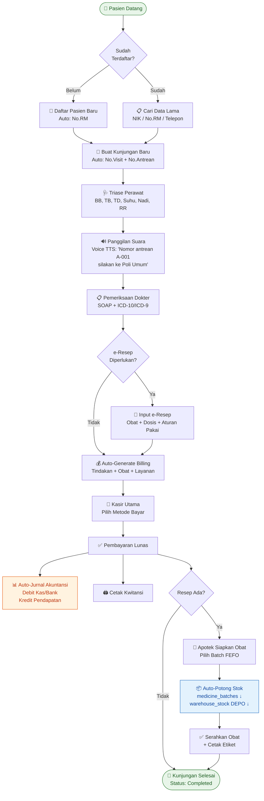

### 7.2 Alur Pengadaan Obat (Procurement)

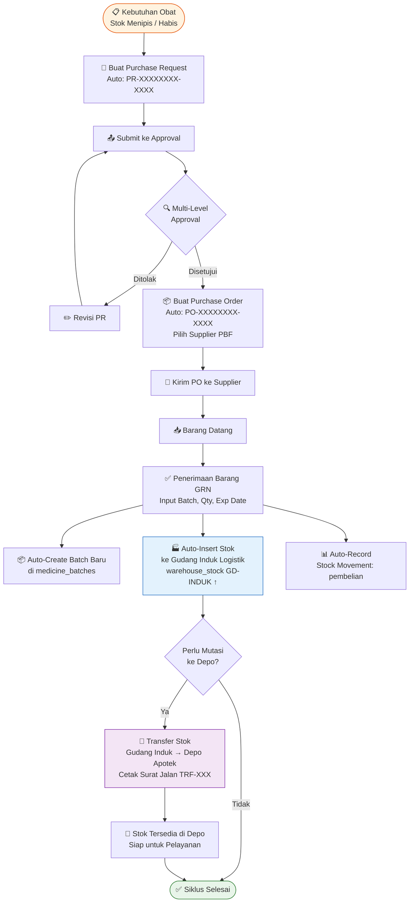

### 7.3 Alur Siklus Stok Obat 360° (Closed-Loop)

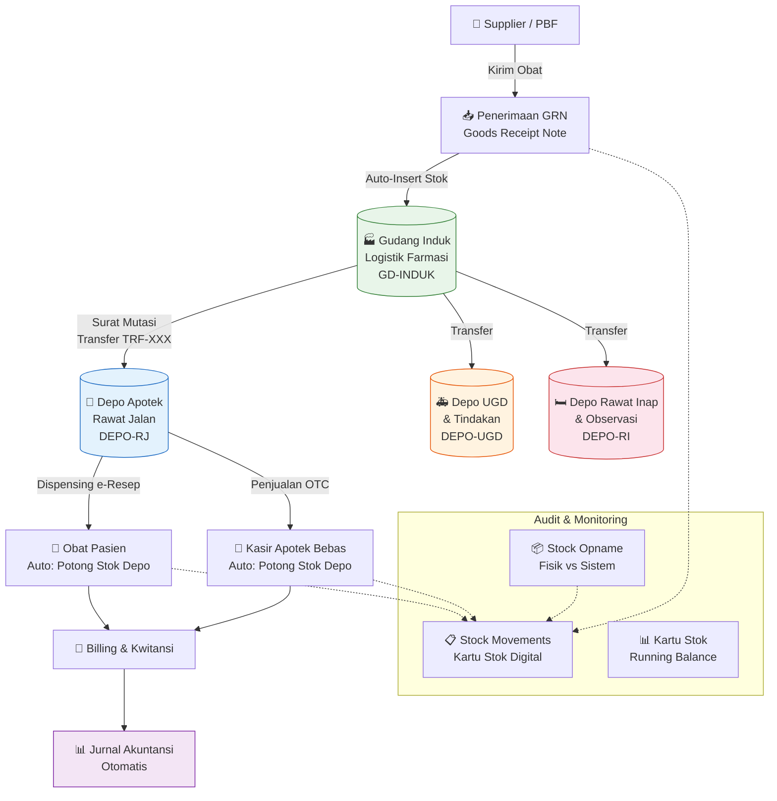

### 7.4 Alur Akuntansi Otomatis (Double-Entry)

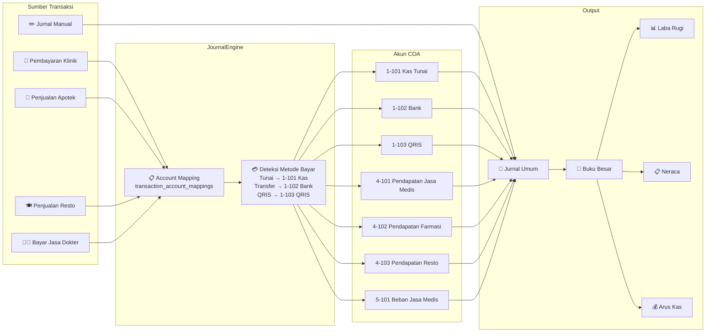

### 7.5 Alur Restoran Gizi & Diet Pasien

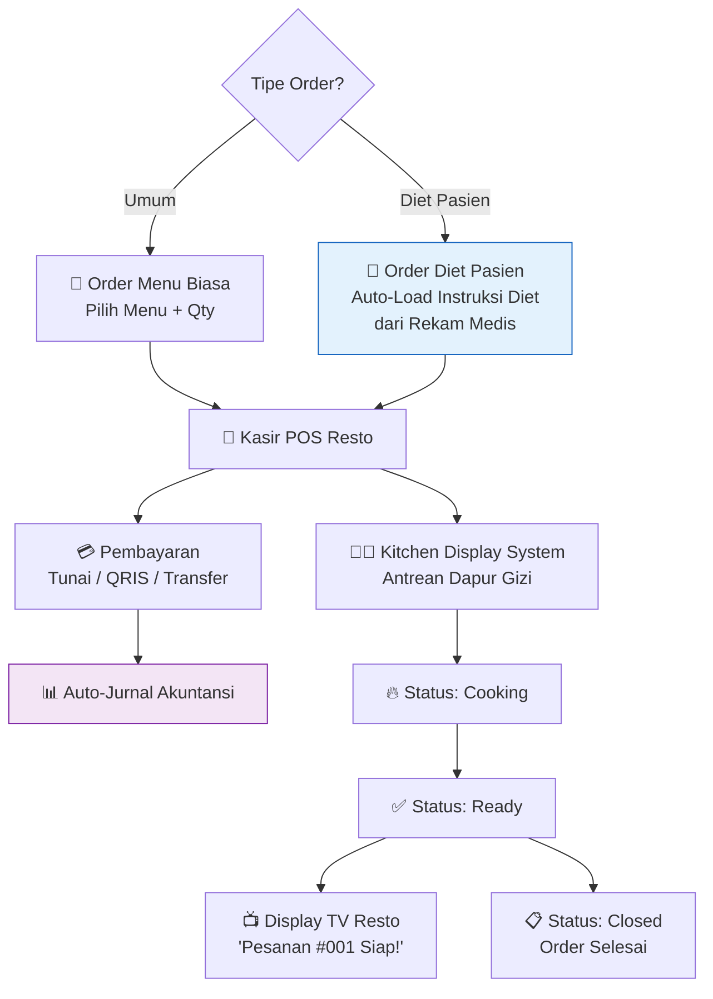

### 7.6 Alur HRD & Penggajian

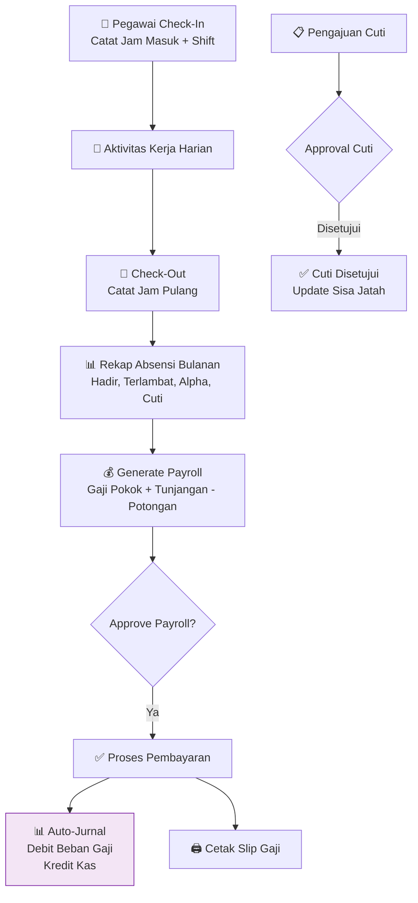

---

## 8. API Layer & Interoperabilitas

### 8.1 RESTful API v1 (Protected by API Key)

| Method | Endpoint | Controller | Deskripsi |
|---|---|---|---|
| `GET` | `/api/v1/antrean` | `AntreanController::index` | Data antrean klinik real-time |
| `GET` | `/api/v1/patients/search` | `PatientController::search` | Pencarian pasien |
| `POST` | `/api/v1/patients/register` | `PatientController::register` | Registrasi pasien baru via API |
| `GET` | `/api/v1/medicines` | `MedicineController::index` | Katalog obat & stok |
| `GET` | `/api/v1/satusehat/encounter/{id}` | `SatuSehatController::encounter` | HL7 FHIR R4 Encounter Resource |

**Autentikasi:** Header `X-API-Key` divalidasi oleh `ApiKeyFilter`.

### 8.2 SATUSEHAT Kemenkes Interoperability

Endpoint `/api/v1/satusehat/encounter/{visitId}` menghasilkan resource **HL7 FHIR R4 Encounter** standar internasional:

```json
{
  "resourceType": "Encounter",
  "id": "ENC-123",
  "identifier": [{ "system": "http://sys-ids.kemkes.go.id/encounter/...", "value": "VST-20260830-0001" }],
  "status": "finished",
  "class": { "system": "http://terminology.hl7.org/CodeSystem/v3-ActCode", "code": "AMB", "display": "ambulatory" },
  "subject": { "reference": "Patient/3271XXXXXXXXXXXX", "display": "Nama Pasien" },
  "participant": [{ "individual": { "display": "dr. Nama Dokter" } }],
  "period": { "start": "2026-08-30T08:00:00+08:00", "end": "2026-08-30T09:15:00+08:00" }
}
```

### 8.3 Real-Time LiveSync API (Zero-Reload)

| Endpoint | Channel | Polling Interval | Konsumen |
|---|---|---|---|
| `/api/sync/ping` | Heartbeat | 30s | Semua halaman |
| `/api/sync/csrf-token` | CSRF Refresh | 60s | Semua form AJAX |
| `/api/sync/klinik-queue` | Antrean Klinik | 5s | Pendaftaran, Display TV |
| `/api/sync/pharmacy-prescriptions` | e-Resep Apotek | 5s | Halaman Tebus Resep |
| `/api/sync/cashier-billings` | Billing Kasir | 5s | Halaman Kasir Utama |
| `/api/sync/resto-kitchen` | Dapur Resto | 5s | Dapur KDS, Display Resto |
| `/api/sync/hrd-presence` | Presensi HRD | 30s | Dashboard Absensi |
| `/api/sync/lab-queue` | Antrean Lab | 10s | Halaman Laboratorium |
| `/api/sync/voice-queue` | Antrean Suara | 3s | Display TV (Voice TTS) |
| `/api/sync/voice-call-trigger` | Trigger Panggilan | On-demand | Pendaftaran, Apotek |
| `/api/sync/voice-call-ack` | Acknowledge | On-demand | Display TV |
| `/api/sync/voice-call-history` | Riwayat Panggilan | On-demand | Admin |

---

## 9. Service Engine Layer

### 9.1 Daftar Service Engine

| Service | File | Fungsi Utama |
|---|---|---|
| **JournalEngine** | `JournalEngine.php` | Auto-posting jurnal double-entry berdasarkan mapping akun + metode pembayaran |
| **PharmacyService** | `PharmacyService.php` | Proses dispensing e-resep + penjualan OTC + sinkronisasi stok multi-gudang |
| **QueueCallService** | `QueueCallService.php` | Anti-collision voice queue engine, TTS narration builder |
| **NotificationService** | `NotificationService.php` | Push notification engine + rules engine + read receipts |
| **ApprovalEngine** | `ApprovalEngine.php` | Multi-level approval workflow (submit → verify → approve) |
| **ClinicService** | `ClinicService.php` | Business logic klinik (visit, queue, triage, billing) |
| **RestoService** | `RestoService.php` | Order processing, KDS integration, diet linking |
| **AuditService** | `AuditService.php` | Audit trail logger |
| **ErrorTrackerService** | `ErrorTrackerService.php` | Centralized error deduplication + hash-based tracking |
| **FinanceService** | `FinanceService.php` | Financial calculation utilities |

### 9.2 Diagram Interaksi Service

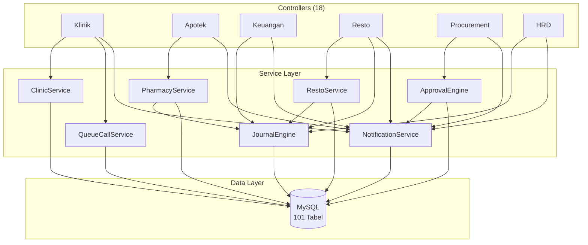

---

## 10. Sistem Keamanan & Otorisasi

### 10.1 HTTP Filters Pipeline

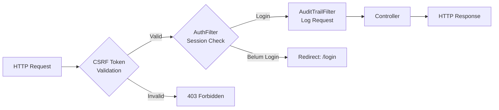

### 10.2 Role-Based Access Control (RBAC)

| # | Role | Akses Utama |
|---|---|---|
| 1 | Super Admin | Seluruh sistem tanpa batasan |
| 2 | IT | Administrasi sistem, backup, error logs |
| 3 | Direktur / Direksi | Dashboard eksekutif, laporan keuangan |
| 4 | Manajemen | Laporan, monitoring, approval |
| 5 | Kepala Klinik | Supervisi pelayanan + konfigurasi master |
| 6 | Dokter | SOAP / RME + e-Resep + Surat Medis |
| 7 | Perawat | Triase + Antrean + Pembantu SOAP |
| 8 | Rekam Medis | Pendaftaran + Cetak RM + Laporan |
| 9 | Apoteker | e-Resep + Stok + Gudang + Opname |
| 10 | Farmasi | Stok + Penerimaan Barang |
| 11 | Kasir | Kasir Utama + Kwitansi |
| 12 | Keuangan | Kas & Bank + Akuntansi + Laporan |
| 13 | HRD | Kepegawaian + Payroll + Absensi |
| 14 | Gudang | Inventaris + Penerimaan + Transfer |
| 15 | Dapur Gizi | KDS Dapur + Antrean Resto |
| 16 | *Role Kustom* | Configurable via admin panel |

### 10.3 Permission Granular (75+ Permissions)

Contoh permission yang tersedia:
- `clinic.register` — Pendaftaran pasien
- `clinic.soap` — Rekam medis SOAP
- `clinic.billing` — Kasir & billing
- `pharmacy.dispense` — Dispensing obat
- `pharmacy.stock` — Manajemen stok
- `finance.manage` — Keuangan & transaksi
- `accounting.ledger` — Akuntansi & jurnal
- `procurement.apply` — Ajukan pengadaan
- `procurement.verify` — Verifikasi pengadaan
- `procurement.approve` — Persetujuan pengadaan
- `inventory.manage` — Manajemen aset
- `hrd.payroll` — Kepegawaian & payroll
- `resto.order` — Order resto
- `resto.kitchen` — Kitchen display
- `system.settings` — Pengaturan sistem
- `users.manage` — Manajemen pengguna
- `audit.view` — Lihat audit trail

---

## 11. Sistem Notifikasi & Real-Time

### 11.1 Arsitektur Notifikasi

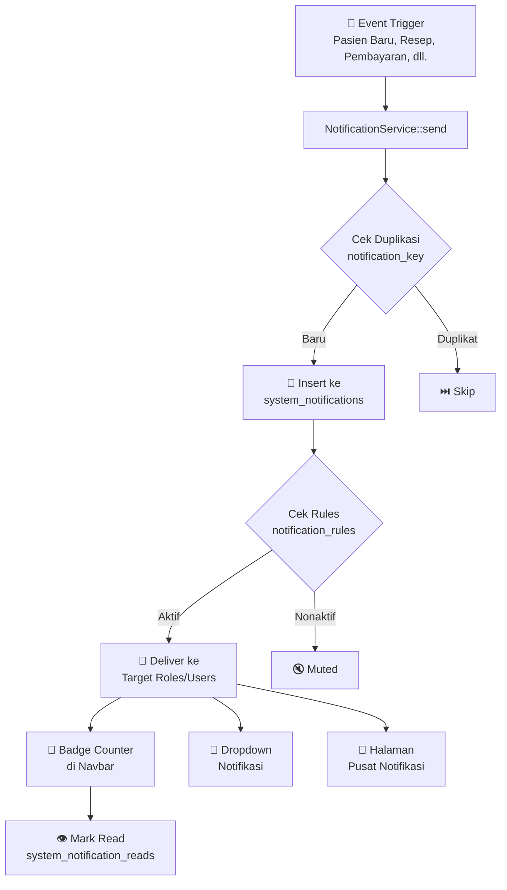

### 11.2 Kategori Notifikasi Aktif

| Kategori | Contoh Event | Target Role |
|---|---|---|
| `pendaftaran` | Pasien baru mendaftar | Rekam Medis, Perawat, Dokter |
| `rekam_medis` | SOAP selesai diisi | Kasir, Apoteker |
| `farmasi` | Obat diserahkan | Apoteker, Farmasi |
| `keuangan` | Pembayaran diterima | Kasir, Keuangan |
| `pengadaan` | PO butuh approval | Manajemen, Direktur |
| `sistem` | Error kritis terdeteksi | IT, Super Admin |
| `hrd` | Pengajuan cuti baru | HRD, Manajemen |

---

## 12. Peta Rute (Route Map)

### 12.1 Rute Publik (Tanpa Login)

| URL | Method | Controller | Keterangan |
|---|---|---|---|
| `/` | GET | `Home::index` | Landing page publik |
| `/daftar-online` | GET/POST | `Home::daftarOnline` | Pendaftaran online pasien |
| `/daftar-online/sukses/{id}` | GET | `Home::suksesDaftar` | Konfirmasi pendaftaran |
| `/berita` | GET | `Home::berita` | Daftar artikel berita |
| `/berita/{slug}` | GET | `Home::berita` | Detail artikel |
| `/klinik/display` | GET | `Klinik::display` | Display TV antrean |
| `/klinik/kiosk` | GET | `Klinik::kiosk` | Kiosk mandiri APM |
| `/login` | GET/POST | `Auth::login` | Halaman login |
| `/logout` | GET | `Auth::logout` | Logout |

### 12.2 Rute Internal (Wajib Login)

> Total: **~150+ route** terdefinisi di `Routes.php` (279 baris)

**Klinik:** 27 rute · **Apotek:** 14 rute · **Resto:** 9 rute · **Keuangan:** 20 rute · **Akuntansi:** 12 rute · **Pengadaan:** 9 rute · **Inventaris:** 6 rute · **HRD:** 11 rute · **Master Data:** 20 rute · **Sistem:** 30 rute

### 12.3 Rute API

| Grup | Jumlah | Filter |
|---|---|---|
| `/api/v1/*` | 5 endpoint | `api_auth` (API Key) |
| `/api/sync/*` | 11 endpoint | Tanpa filter (internal polling) |

---

## 13. Diagram Alur Sistem (Flowchart)

### 13.1 Arsitektur Ekosistem Terintegrasi

```mermaid
flowchart TB
    subgraph "🌐 Frontend Channels"
        WEB[🖥️ Admin Dashboard]
        TV[📺 Display TV Klinik]
        TV2[📺 Display TV Resto]
        KIOSK[🖥️ Kiosk APM]
        ONLINE[📱 Pendaftaran Online]
        API_EXT[🔌 External API Client]
    end

    subgraph "🏥 MODUL PELAYANAN KLINIK"
        DAFTAR[📝 Pendaftaran]
        ANTREAN[🔢 Antrean & Voice]
        TRIASE[🩺 Triase Perawat]
        SOAP_MOD[📋 SOAP / RME]
        LAB[🔬 Laboratorium]
        SURAT[📄 Surat & Rujukan]
    end

    subgraph "💊 MODUL FARMASI & APOTEK"
        ERESEP[📑 e-Resep Dokter]
        POS_APT[💳 POS Apotek OTC]
        STOK[📦 Stok & Batch]
        GUDANG[🏭 Multi-Gudang]
        OPNAME[📋 Stock Opname]
        KARTU[📊 Kartu Stok]
    end

    subgraph "🍽️ MODUL RESTORAN GIZI"
        POS_RST[💳 POS Resto]
        KDS[👨‍🍳 Kitchen Display]
        DIET[🥗 Integrasi Diet]
    end

    subgraph "💰 MODUL KEUANGAN"
        KASIR_U[🧾 Kasir Utama]
        KAS_BANK[💳 Kas & Bank]
        AGING[⏳ Aging Piutang]
        FEE_DR[👨‍⚕️ Jasa Dokter]
        REKAP_HR[📊 Rekap Harian]
    end

    subgraph "📊 MODUL AKUNTANSI"
        COA[📒 Chart of Accounts]
        JURNAL_U[📗 Jurnal Umum]
        BUKU_B[📘 Buku Besar]
        LAP_KEU[📊 Laporan Keuangan]
    end

    subgraph "🏗️ MODUL PENGADAAN"
        PR[📝 Purchase Request]
        PO_MOD[📦 Purchase Order]
        GRN_MOD[📥 Penerimaan GRN]
        APPROVAL_MOD[✅ Approval Workflow]
    end

    subgraph "👥 MODUL HRD"
        PEGAWAI[👤 Data Pegawai]
        ABSENSI[📅 Presensi]
        PAYROLL_MOD[💰 Payroll]
        CUTI[📋 Cuti]
    end

    subgraph "⚙️ ENGINE SERVICES"
        JE_SVC[JournalEngine]
        PS_SVC[PharmacyService]
        QC_SVC[QueueCallService]
        NS_SVC[NotificationService]
        AE_SVC[ApprovalEngine]
        RS_SVC[RestoService]
        LS_SVC[LiveSync Engine]
    end

    subgraph "🗄️ DATABASE"
        DB[(sawamawa_erp<br/>101 Tabel<br/>MySQL 8.0)]
    end

    %% Frontend to Modules
    WEB --> DAFTAR & SOAP_MOD & KASIR_U & POS_APT
    TV --> ANTREAN
    TV2 --> KDS
    KIOSK --> DAFTAR
    ONLINE --> DAFTAR
    API_EXT --> DB

    %% Clinical Flow
    DAFTAR --> ANTREAN --> TRIASE --> SOAP_MOD
    SOAP_MOD --> ERESEP & LAB & SURAT
    SOAP_MOD --> KASIR_U

    %% Pharmacy Flow
    ERESEP --> PS_SVC --> STOK & GUDANG
    POS_APT --> PS_SVC
    STOK --> OPNAME & KARTU

    %% Finance Flow
    KASIR_U --> JE_SVC --> JURNAL_U --> BUKU_B --> LAP_KEU
    FEE_DR --> JE_SVC
    POS_RST --> RS_SVC --> JE_SVC

    %% Procurement Flow
    PR --> APPROVAL_MOD --> AE_SVC
    PO_MOD --> GRN_MOD --> GUDANG

    %% HRD Flow
    PAYROLL_MOD --> JE_SVC

    %% Services to DB
    JE_SVC --> DB
    PS_SVC --> DB
    QC_SVC --> DB
    NS_SVC --> DB
    AE_SVC --> DB
    RS_SVC --> DB
    LS_SVC --> DB

    %% Cross-Module
    ANTREAN -.-> QC_SVC
    DAFTAR -.-> NS_SVC
    KASIR_U -.-> NS_SVC
    ERESEP -.-> NS_SVC
    APPROVAL_MOD -.-> NS_SVC
```

---

## 14. Panduan Deployment & Konfigurasi

### 14.1 Prasyarat Sistem

| Komponen | Minimum | Rekomendasi |
|---|---|---|
| PHP | 8.0 | 8.2+ |
| MySQL | 5.7 | 8.0+ |
| Web Server | Apache 2.4 | Apache 2.4 + `mod_rewrite` |
| RAM Server | 2 GB | 4 GB+ |
| Storage | 10 GB | 50 GB+ (untuk backup & uploads) |
| Browser | Chrome 80+ | Chrome/Edge terbaru |

### 14.2 Langkah Instalasi

```bash
# 1. Clone/Extract ke web root
cp -r sawamawamedicalcenter.id/ /var/www/html/
# atau untuk XAMPP:
# Extract ke C:\xampp\htdocs\sawamawamedicalcenter.id\

# 2. Install dependencies
cd sawamawamedicalcenter.id
composer install

# 3. Konfigurasi Environment
cp .env.development .env
# Edit .env: sesuaikan database credentials dan base URL

# 4. Import Database
mysql -u root -p sawamawa_erp < database/dumps/latest.sql

# 5. Set permissions (Linux)
chmod -R 777 writable/
chmod -R 755 public/assets/uploads/

# 6. Konfigurasi Apache Virtual Host (Opsional)
# Atau gunakan: http://localhost/sawamawamedicalcenter.id/public/
```

### 14.3 Konfigurasi Environment (`.env`)

```ini
# ENVIRONMENT
CI_ENVIRONMENT = development          # development | production

# APPLICATION
app.baseURL = 'http://localhost/sawamawamedicalcenter.id/public/'
app.indexPage = ''
app.forceGlobalSecureRequests = false
app.appTimezone = 'Asia/Makassar'     # WITA (UTC+8)

# DATABASE
database.default.hostname = localhost
database.default.database = sawamawa_erp
database.default.username = root
database.default.password =
database.default.DBDriver = MySQLi
database.default.port     = 3306
database.default.charset  = utf8mb4
database.default.DBCollat = utf8mb4_unicode_ci
```

### 14.4 Konfigurasi Sistem (via Admin Panel)

Setelah login sebagai Super Admin, akses **Pengaturan Klinik** (`/system/settings`) untuk mengonfigurasi:

| Grup | Pengaturan | Contoh Nilai |
|---|---|---|
| Profil Klinik | `clinic_name` | SAWAMAWA MEDICAL CENTER |
| | `clinic_address` | Jl. Contoh No. 123, Kota |
| | `clinic_phone` | 0411-XXXXXXX |
| Voice Calling | `voice_gender` | female / male |
| | `voice_rate` | 0.85 |
| | `voice_chime_type` | hospital_2tone / ding_dong / bell |
| UI Theme | `admin_theme` | theme-macos / theme-paper / theme-emerald / theme-xp |

---

## 15. Changelog & Riwayat Versi

### v3.7.0 — Multi-Gudang 360° Integration *(30 Agustus 2026)*
- ✅ Integrasi stok dispensing e-Resep → warehouse_stock Depo Apotek
- ✅ Integrasi stok penjualan OTC → warehouse_stock Depo Apotek
- ✅ Fix syntax error Procurement GRN → warehouse_stock Gudang Induk
- ✅ Closed-loop: Pengadaan → Gudang Induk → Transfer → Depo → Pelayanan → Stok Terpotong

### v3.6.0 — Gudang Multi-Depo & Transfer Stok *(30 Agustus 2026)*
- ✅ Tabel baru: `pharmacy_warehouses`, `warehouse_stock`, `stock_transfers`, `stock_transfer_items`
- ✅ Halaman Gudang & Multi-Depo dengan stok per lokasi
- ✅ Form transfer stok antar gudang + cetak surat jalan mutasi
- ✅ Auto-insert stok ke Gudang Induk saat penerimaan barang (GRN)

### v3.5.0 — Sistem Inspeksi & Penyempurnaan *(29 Agustus 2026)*
- ✅ Final system inspection: 101 tabel, 0 syntax error
- ✅ Verifikasi alur klinik end-to-end
- ✅ Penyempurnaan foreign key relations

### v3.4.0 — Ekspor Excel Multi-Sheet *(29 Agustus 2026)*
- ✅ Laporan komprehensif 4 sheet dalam 1 file Excel
- ✅ Ringkasan keuangan, billing, apotek, kunjungan pasien

### v3.3.0 — Akuntansi Double-Entry Penuh *(29 Agustus 2026)*
- ✅ Chart of Accounts (COA) dengan 5 tipe akun
- ✅ JournalEngine auto-posting dengan deteksi metode pembayaran
- ✅ Buku Besar, Laba Rugi, Neraca, Arus Kas, Perubahan Ekuitas

### v3.2.0 — Pengadaan & Approval Workflow *(28 Agustus 2026)*
- ✅ Purchase Request → Purchase Order → Goods Receipt
- ✅ Multi-level approval engine
- ✅ Cetak dokumen PR, PO, GRN (PDF)

### v3.1.0 — HRD, Payroll & KPI *(28 Agustus 2026)*
- ✅ Manajemen pegawai, absensi, shift kerja
- ✅ Generate payroll + auto-jurnal
- ✅ Pengajuan & approval cuti
- ✅ Dashboard KPI

### v3.0.0 — Restoran Gizi & Integrasi Diet *(27 Agustus 2026)*
- ✅ POS Resto + Kitchen Display System (KDS)
- ✅ Display TV antrean restoran
- ✅ Integrasi diet pasien dari rekam medis
- ✅ Auto-jurnal akuntansi penjualan resto

### v2.5.0 — Voice Calling & Kiosk Mandiri *(27 Agustus 2026)*
- ✅ Anti-collision voice queue engine
- ✅ Web Speech API TTS (Indonesia)
- ✅ Kiosk mandiri (APM) fullscreen
- ✅ Konfigurasi voice (gender, rate, pitch, volume, chime)

### v2.0.0 — Kasir, Billing & Keuangan *(26 Agustus 2026)*
- ✅ Kasir utama multi metode pembayaran
- ✅ Billing otomatis dari SOAP
- ✅ Aging schedule piutang
- ✅ Jasa medis dokter
- ✅ Cetak kwitansi

### v1.0.0 — Klinik Core *(25 Agustus 2026)*
- ✅ Pendaftaran pasien + antrean
- ✅ SOAP / Rekam Medis Elektronik
- ✅ e-Resep + dispensing apotek
- ✅ Laboratorium
- ✅ Surat medis & rujukan
- ✅ Dashboard dasar

---

## Lampiran

### A. Diagram Relasi Antar Modul (Dependency Map)

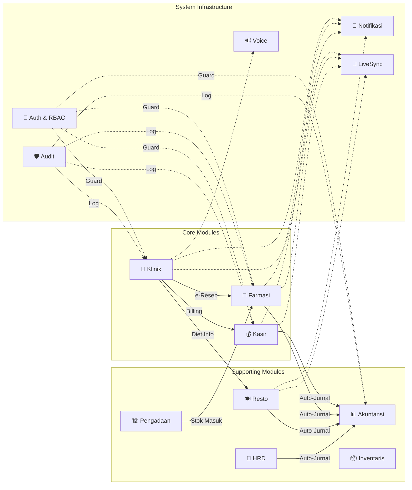

### B. Statistik Proyek

| Metrik | Nilai |
|---|---|
| Total Controllers | 18 + 5 API = **23** |
| Total Services | **10** |
| Total Models | **33** |
| Total Views | **~90 files** |
| Total Routes | **~150+ endpoints** |
| Total Database Tables | **101** |
| Total Roles | **16** |
| Total Permissions | **75+** |
| Bahasa UI | **Bahasa Indonesia** |
| Multi-Theme | **4 tema** (Paper White, macOS, Emerald, Windows XP) |
| Code Base Size | **~1.2 MB** (PHP Controllers + Services) |
| Master Layout | **1,786 baris** |
| Largest Controller | `Klinik.php` — **171,440 bytes** |

---

> **Dokumen ini dibuat secara otomatis dan diverifikasi pada 30 Agustus 2026.**
> **Hak Cipta © 2026 Sawamawa Medical Center. Seluruh Hak Dilindungi.**
