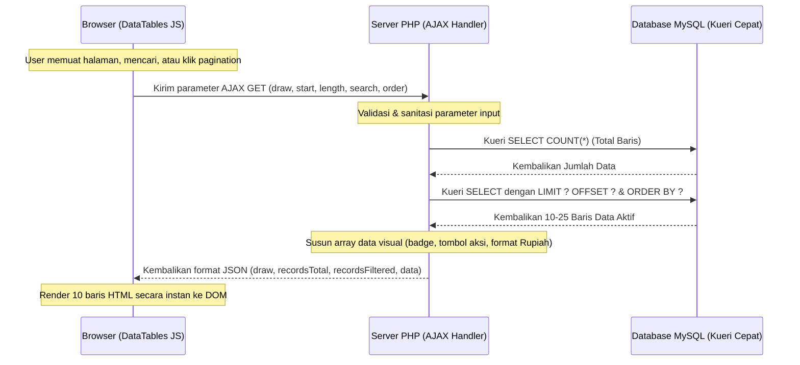

# Panduan Implementasi DataTables Server-Side Processing

Dokumen ini berisi penjelasan, arsitektur, dan template referensi untuk menerapkan **DataTables Server-Side Processing** pada SIM Pengumpulan ZIS BAZNAS Sumbawa. Standar ini wajib digunakan untuk semua halaman yang memuat tabel data dengan volume catatan besar (seperti Transaksi, Muzaki, UPZ, dan Log Audit).

---

## 1. Perbedaan Client-Side vs Server-Side

| Fitur | Client-Side (Bawaan Lama) | Server-Side Processing (Standar Baru) |
| :--- | :--- | :--- |
| **Beban Server PHP** | **Sangat Berat**. Menarik ribuan baris data sekaligus ke RAM server. | **Sangat Ringan**. Hanya menarik 10-25 baris data halaman aktif ke RAM. |
| **Ukuran Transmisi** | **Sangat Besar**. Mengirim berkas HTML berukuran Megabytes ke browser. | **Sangat Kecil**. Hanya mengirim JSON berukuran beberapa Kilobytes. |
| **Kecepatan Awal** | **Lambat (membeku)**. Browser rendering ribuan elemen DOM `<tr>`. | **Instan (< 20ms)**. Browser hanya memuat halaman kosong. |
| **Proses Cari & Urut**| Dilakukan oleh Javascript browser (membekukan tab browser). | Dilakukan langsung oleh mesin database MySQL (sangat cepat). |

---

## 2. Alur Kerja Arsitektur (Data Flow)



---

## 3. Template Implementasi Kode

Gunakan struktur kode di bawah ini sebagai template standar saat membuat halaman tabel data baru:

### A. Kode Backend PHP (Sisi Server - AJAX Handler)

Letakkan script handler ini di bagian paling atas halaman PHP (sebelum HTML apa pun dikirim):

```php
<?php
require_once __DIR__ . '/../../config/helpers.php';
require_auth();

$conn = db();

// 1. AJAX Handler untuk DataTables Server-Side
if ($_SERVER['REQUEST_METHOD'] === 'GET' && isset($_GET['draw'])) {
    header('Content-Type: application/json');
    $draw = (int)$_GET['draw'];
    $start = (int)($_GET['start'] ?? 0);
    $length = (int)($_GET['length'] ?? 10);
    $searchValue = trim($_GET['search']['value'] ?? '');
    
    // Urutan Pengurutan (Sorting)
    $orderColumnIndex = (int)($_GET['order'][0]['column'] ?? 0);
    $orderDir = $_GET['order'][0]['dir'] ?? 'asc';
    
    // Petakan indeks kolom DataTables ke kolom database asli Anda
    $columns = [
        0 => 't.id',
        1 => 't.tanggal_transaksi',
        2 => 'm.nama_muzaki',
        3 => 't.jumlah_pembayaran'
    ];
    
    $orderColumn = $columns[$orderColumnIndex] ?? 't.id';
    if (!in_array(strtolower($orderDir), ['asc', 'desc'])) {
        $orderDir = 'asc';
    }
    
    // Gabungan SQL awal (FROM & JOIN)
    $sqlFrom = " FROM transaksi t 
                 LEFT JOIN muzaki m ON t.id_muzaki = m.id";
    
    // Filter Pencarian (Searching)
    $where = " WHERE 1=1";
    $searchParams = [];
    $searchTypes = "";
    if ($searchValue !== '') {
        $where .= " AND (m.nama_muzaki LIKE ? OR t.keterangan LIKE ?)";
        $searchWildcard = "%" . $searchValue . "%";
        $searchParams[] = $searchWildcard;
        $searchParams[] = $searchWildcard;
        $searchTypes .= "ss";
    }
    
    // Hitung total data keseluruhan (tanpa filter)
    $totalRecords = $conn->query("SELECT COUNT(*) FROM transaksi")->fetch_row()[0] ?? 0;
    
    // Hitung total data tersaring (dengan filter pencarian jika ada)
    $filteredQuery = "SELECT COUNT(*) " . $sqlFrom . $where;
    if ($searchValue !== '') {
        $stmt = $conn->prepare($filteredQuery);
        $stmt->bind_param($searchTypes, ...$searchParams);
        $stmt->execute();
        $totalRecordwithFilter = $stmt->get_result()->fetch_row()[0] ?? 0;
        $stmt->close();
    } else {
        $totalRecordwithFilter = $conn->query($filteredQuery)->fetch_row()[0] ?? 0;
    }
    
    // Tarik data dengan LIMIT & OFFSET
    $sqlSelect = "SELECT t.*, m.nama_muzaki";
    $dataQuery = $sqlSelect . $sqlFrom . $where . " ORDER BY " . $orderColumn . " " . $orderDir . " LIMIT ? OFFSET ?";
    
    $stmt = $conn->prepare($dataQuery);
    if ($searchValue !== '') {
        $types = $searchTypes . "ii";
        $bindParams = array_merge($searchParams, [$length, $start]);
        $stmt->bind_param($types, ...$bindParams);
    } else {
        $stmt->bind_param("ii", $length, $start);
    }
    
    $stmt->execute();
    $result = $stmt->get_result();
    $data = [];
    
    $no = $start + 1;
    while ($row = $result->fetch_assoc()) {
        // Format visual HTML disiapkan langsung di server
        $actionButtons = '
            <button class="btn btn-outline-info btn-xs" onclick="viewDetail(' . $row['id'] . ')"><i class="fas fa-eye"></i></button>
            <button class="btn btn-outline-primary btn-xs" onclick="editData(' . $row['id'] . ')"><i class="fas fa-edit"></i></button>
        ';
        
        $data[] = [
            $no++,
            date('d/m/Y', strtotime($row['tanggal_transaksi'])),
            '<strong>' . clean($row['nama_muzaki']) . '</strong>',
            'Rp ' . number_format($row['jumlah_pembayaran'], 0, ',', '.'),
            '<div class="text-center">' . $actionButtons . '</div>'
        ];
    }
    $stmt->close();
    
    // Kirim respons balik sebagai JSON
    echo json_encode([
        "draw" => $draw,
        "recordsTotal" => $totalRecords,
        "recordsFiltered" => $totalRecordwithFilter,
        "data" => $data
    ]);
    exit;
}

include __DIR__ . '/../../inc/header.php';
?>
```

### B. Markup HTML (Sisi Client - Kerangka Tabel Kosong)

Markup HTML tabel cukup dibuat strukturnya saja tanpa memuat perulangan PHP loop `while`:

```html
<div class="card shadow-none border" style="border: 1px solid #b8b8b8;">
    <div class="card-body p-0">
        <table id="dataTable" class="table table-bordered table-hover mb-0" style="font-size: 0.85rem;">
            <thead>
                <tr>
                    <th width="3%">No</th>
                    <th>Tanggal</th>
                    <th>Nama Muzaki</th>
                    <th>Jumlah</th>
                    <th width="10%">Aksi</th>
                </tr>
            </thead>
            <tbody>
                <!-- KOSONG. Baris HTML diisi secara dinamis oleh AJAX DataTables -->
            </tbody>
        </table>
    </div>
</div>
```

### C. Kode Javascript (Sisi Client - Inisialisasi)

Inisialisasi DataTables menggunakan opsi AJAX server-side di bagian bawah halaman:

```javascript
$(function () {
    $('#dataTable').DataTable({
        processing: true,      // Menampilkan loading spinner/indikator pemrosesan
        serverSide: true,      // Mengaktifkan mode Server-Side Processing
        ajax: {
            url: window.location.href, // Mengarah ke script PHP handler di atas
            type: 'GET'
        },
        order: [[1, 'desc']],  // Urutan pengurutan default (Kolom Tanggal)
        columnDefs: [
            { targets: [0, 4], orderable: false }, // Kolom No & Aksi dinonaktifkan dari sorting
            { targets: [3], className: 'text-right' }, // Kolom Jumlah rata kanan
            { targets: [0, 4], className: 'text-center' } // Kolom No & Aksi rata tengah
        ],
        language: {
            processing: '<div class="text-center py-2"><i class="fa fa-spinner fa-spin fa-2x text-success"></i></div>',
            search: "Cari:",
            lengthMenu: "Tampilkan _MENU_ entri",
            info: "Menampilkan _START_ sampai _END_ dari _TOTAL_ entri",
            infoEmpty: "Menampilkan 0 sampai 0 dari 0 entri",
            infoFiltered: "(disaring dari _MAX_ total entri)",
            paginate: {
                first: "Pertama",
                last: "Terakhir",
                next: "Berikutnya",
                previous: "Sebelumnya"
            }
        }
    });
});
```

---

## 4. Keuntungan Tambahan untuk Keamanan & Keandalan

1. **Prepared Statements**: Parameter `LIMIT`, `OFFSET`, dan `search` diproses secara aman menggunakan parameter binding MySQLi (`bind_param`), memberikan perlindungan total terhadap ancaman celah **SQL Injection**.
2. **Pencarian Ringan**: Indeks pencarian menggunakan string global `LIKE` yang hanya memproses kueri pencarian teks setelah user selesai mengetik, menghemat pemrosesan kueri di mesin MySQL database server.

---

## 5. Metode Terpusat Global (`datatable_handler`)

Untuk menyederhanakan kode pada berbagai halaman master, kita telah membuat fungsi helper terpusat **`datatable_handler()`** di berkas [config/helpers.php](file:///c:/xampp/htdocs/pengumpulan.baznassumbawa.id/config/helpers.php). Metode ini mengotomatiskan seluruh alur server-side (sorting, searching, paging, prepared statements) dan meminimalkan duplikasi kode.

### Cara Penggunaan di PHP:
Cukup panggil fungsi ini di awal halaman script GET:

```php
if ($_SERVER['REQUEST_METHOD'] === 'GET' && isset($_GET['draw'])) {
    datatable_handler('nama_tabel t', [
        0 => 't.id',
        1 => 't.kolom_satu',
        2 => 't.kolom_dua'
    ], [
        'select' => 't.*, u.nama_relasi',
        'joins' => 'LEFT JOIN tabel_relasi u ON t.id_relasi = u.id',
        'where' => "t.is_active = 1", // Filter opsional
        'search_columns' => ['t.kolom_satu', 'u.nama_relasi'],
        'row_formatter' => function($row, $no) {
            return [
                $no,
                '<strong>' . clean($row['kolom_satu']) . '</strong>',
                clean($row['nama_relasi']),
                '<button class="btn btn-warning btn-xs" onclick="editData(' . $row['id'] . ')">Edit</button>'
            ];
        }
    ]);
}
```

---

## 6. Deferred Rendering Client-Side (Kasus Khusus Laporan)

Pada halaman laporan (seperti [pages/laporan/index.php](file:///c:/xampp/htdocs/pengumpulan.baznassumbawa.id/pages/laporan/index.php)), sistem membutuhkan seluruh data transaksi dalam bentuk JSON di browser (untuk grafik dashboard visual dan fitur *Enhanced Copy HTML*). 

Namun, merender ribuan baris `<tr>` secara langsung di HTML akan membekukan browser. Solusinya adalah mengirim data sebagai JSON tunggal, lalu diinisialisasi menggunakan **Deferred Rendering**:

### Langkah Implementasi:
1. **Kosongkan tag `<tbody>`** pada tabel HTML:
   ```html
   <table id="dataTable">
       <thead>...</thead>
       <tbody></tbody> <!-- Wajib Kosong -->
   </table>
   ```
2. **Kirim data sebagai JSON** di script browser:
   ```javascript
   const reportTransactions = <?= json_encode($transactions) ?>;
   ```
3. **Inisialisasi DataTable dengan `deferRender: true`**:
   ```javascript
   const dataSet = reportTransactions.map((row, idx) => [
       idx + 1,
       row.tanggal,
       row.nama_muzaki,
       'Rp ' + parseInt(row.jumlah).toLocaleString('id-ID')
   ]);

   $('#dataTable').DataTable({
       data: dataSet,
       deferRender: true, // HANYA membuat baris DOM pada halaman aktif saja
       pageLength: 25
   });
   ```
   *Manfaat*: Rendering halaman sangat instan (< 10ms) meskipun memuat 10.000 data, sementara data mentah di memori browser tetap utuh untuk keperluan ekspor dan dashboard.
