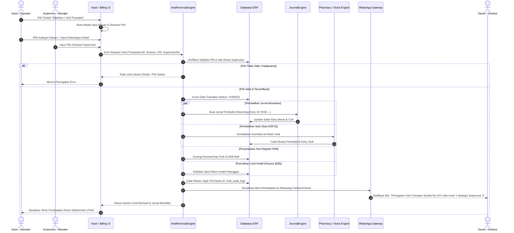

# 🛡️ SPESIFIKASI RANCANGAN SISTEM PUSAT LOG PEMBATALAN / VOID (ANTI-FRAUD CENTER)
## Sawamawa Medical Center ERP - Gitria Farma

---

## 📌 1. Ringkasan Eksekutif

**Pusat Log Pembatalan / Void Transaksi (Anti-Fraud Center)** adalah sub-sistem keamanan dan tata kelola keuangan yang bertugas mengontrol, memvalidasi, mencatat, dan membalikkan (*reversing*) setiap pembatalan transaksi secara otomatis di seluruh unit operasional klinik, apotek retail, distributor grosir B2B, kasir, dan restoran sehat.

### 🎯 Tujuan Utama:
1. **Pencegahan Kecurangan Kasir (*Anti-Fraud / Anti-Embezzlement*)**: Mencegah kasir/staf membatalkan nota kasir setelah menerima uang tunai dari pasien.
2. **Integritas Jurnal Double-Entry (100% Balanced)**: Setiap transaksi yang dibatalkan langsung dibuatkan **Jurnal Pembalik (*Reversing Journal Entry*)** atau penyesuaian buku besar secara otomatis tanpa merusak riwayat transaksi lampau.
3. **Pemulihan Stok Otomatis (*Stock Restoration*)**: Stok obat, batch FEFO, dan kartu stok dipulihkan ke posisi semula secara akurat.
4. **Persetujuan Bertingkat (*Supervisor PIN Gate*)**: Pembatalan hanya sah jika disetujui oleh Supervisor / Manajer Keuangan / Direktur melalui PIN / Password Otorisasi.
5. **Transparansi & Notifikasi Real-Time**: Setiap tindakan void langsung tercatat di Audit Trail dan mengirimkan alert WhatsApp otomatis ke Manajemen.

---

## 🔄 2. Diagram Alur Sistem Void & Otorisasi Anti-Fraud



---

## 🗄️ 3. Struktur Skema Database Relasional

### A. Tabel `void_audit_logs` (Pusat Log Pembatalan Permanen)
Tabel *immutable* (tidak dapat diubah atau dihapus) untuk melacak seluruh transaksi yang dibatalkan di sistem.

```sql
CREATE TABLE `void_audit_logs` (
  `id` BIGINT UNSIGNED NOT NULL AUTO_INCREMENT,
  `void_number` VARCHAR(64) NOT NULL UNIQUE COMMENT 'Nomor unik log void: VOID-YYYYMMDD-XXXX',
  `transaction_type` ENUM('billing_klinik', 'pharmacy_sale', 'distributor_sale', 'receivable_payment', 'cash_expense', 'cash_transfer', 'resto_sale', 'doctor_fee', 'goods_receipt') NOT NULL,
  `reference_id` BIGINT UNSIGNED NOT NULL COMMENT 'ID baris transaksi asal',
  `reference_number` VARCHAR(64) NOT NULL COMMENT 'No. Invoice / No. Resep / No. Kuitansi asal',
  `total_amount` DECIMAL(15,2) NOT NULL DEFAULT 0.00 COMMENT 'Nominal bruto transaksi yang dibatalkan',
  `payment_method` VARCHAR(32) NOT NULL DEFAULT 'tunai',
  `cash_register_id` INT UNSIGNED NULL COMMENT 'ID Shift Kasir aktif saat void dilakukan',
  `reversal_journal_id` BIGINT UNSIGNED NULL COMMENT 'ID Jurnal Pembalik di journal_entries',
  `reason_category` VARCHAR(64) NOT NULL COMMENT 'Kategori: Salah Input, Pasien Batal, Resep Direvisi, dll.',
  `reason_detail` TEXT NOT NULL COMMENT 'Alasan rinci pembatalan',
  `cashier_user_id` INT UNSIGNED NOT NULL COMMENT 'User kasir/staf yang mengajukan',
  `supervisor_user_id` INT UNSIGNED NOT NULL COMMENT 'User supervisor yang mengotorisasi PIN',
  `ip_address` VARCHAR(45) NOT NULL,
  `user_agent` VARCHAR(255) NULL,
  `item_snapshot_json` LONGTEXT NOT NULL COMMENT 'Snapshot JSON lengkap seluruh item transaksi saat dibatalkan',
  `created_at` DATETIME NOT NULL DEFAULT CURRENT_TIMESTAMP,
  PRIMARY KEY (`id`),
  INDEX `idx_void_trx` (`transaction_type`, `reference_id`),
  INDEX `idx_void_created` (`created_at`),
  INDEX `idx_void_supervisor` (`supervisor_user_id`)
) ENGINE=InnoDB DEFAULT CHARSET=utf8mb4 COLLATE=utf8mb4_unicode_ci;
```

### B. Tabel `void_reasons_master` (Master Kategori Alasan Pembatalan)
Daftar pilihan alasan standar agar data pembatalan terstruktur dan dapat dianalisis di laporan manajerial.

```sql
CREATE TABLE `void_reasons_master` (
  `id` INT UNSIGNED NOT NULL AUTO_INCREMENT,
  `category_name` VARCHAR(100) NOT NULL,
  `module` ENUM('all', 'klinik', 'apotek', 'distributor', 'resto', 'keuangan') NOT NULL DEFAULT 'all',
  `is_active` TINYINT(1) NOT NULL DEFAULT 1,
  PRIMARY KEY (`id`)
) ENGINE=InnoDB DEFAULT CHARSET=utf8mb4;

-- Data Awal Standar:
INSERT INTO `void_reasons_master` (`category_name`, `module`) VALUES
('Salah Input Jumlah / Kuantitas Barang', 'all'),
('Salah Pilih Nama Obat / Tindakan Medis', 'all'),
('Pasien Batal Berobat / Pindah Faskes', 'klinik'),
('Dokter Merevisi e-Resep', 'apotek'),
('Salah Memilih Metode Pembayaran (Tunai vs QRIS/Transfer)', 'keuangan'),
('Pelanggan Grosir Merubah Surat Pesanan', 'distributor'),
('Transaksi Duplikat / Double Input Kasir', 'all'),
('Uang Pasien / Kartu Tidak Mencukupi saat Pembayaran', 'keuangan');
```

### C. Tabel `supervisor_pins` (Kunci Otorisasi Supervisor)
Tabel penyimpanan PIN supervisor terenkripsi dengan proteksi *brute-force lockout*.

```sql
CREATE TABLE `supervisor_pins` (
  `id` INT UNSIGNED NOT NULL AUTO_INCREMENT,
  `user_id` INT UNSIGNED NOT NULL UNIQUE,
  `pin_hash` VARCHAR(255) NOT NULL,
  `failed_attempts` TINYINT NOT NULL DEFAULT 0,
  `is_locked` TINYINT(1) NOT NULL DEFAULT 0,
  `locked_until` DATETIME NULL,
  `updated_at` DATETIME NOT NULL DEFAULT CURRENT_TIMESTAMP ON UPDATE CURRENT_TIMESTAMP,
  PRIMARY KEY (`id`),
  FOREIGN KEY (`user_id`) REFERENCES `users` (`id`) ON DELETE CASCADE
) ENGINE=InnoDB DEFAULT CHARSET=utf8mb4;
```

---

## ⚙️ 4. Logika & Mekanisme Otomasi Reversing Engine (`VoidReversalEngine.php`)

Ketika kasir mengklik **"Void Transaksi"** dan PIN Supervisor terverifikasi, service `VoidReversalEngine` mengeksekusi 5 langkah atomik dalam 1 transaksi database (`DB::transBegin` & `DB::transCommit`):

```php
namespace App\Services;

class VoidReversalEngine
{
    /**
     * Eksekusi Pembatalan Transaksi Terpusat (Atomic Transaction)
     */
    public function executeVoid($transactionType, $referenceId, $reasonCategory, $reasonDetail, $supervisorUserId, $cashierUserId)
    {
        $db = \Config\Database::connect();
        $db->transBegin();

        try {
            // 1. Ambil data transaksi asal dan validasi apakah sudah pernah di-void
            $trx = $this->loadAndLockTransaction($db, $transactionType, $referenceId);
            if ($trx->is_voided) {
                throw new \Exception("Transaksi ini sudah pernah dibatalkan sebelumnya.");
            }

            // 2. Pembalikan Jurnal Akuntansi Double-Entry
            $reversalJournalId = $this->reverseAccountingJournal($db, $transactionType, $trx);

            // 3. Pembalikan Fisik Stok & Kartu Stok (Jika modul Apotek / Distributor / Logistik)
            $this->restoreInventoryStock($db, $transactionType, $trx);

            // 4. Penyesuaian Kas Register Shift Kasir (Jika metode Tunai)
            $this->adjustCashRegisterShift($db, $trx);

            // 5. Update Status Transaksi Asal menjadi 'VOID' / 'CANCELLED'
            $this->markTransactionAsVoided($db, $transactionType, $referenceId);

            // 6. Simpan Log Audit Permanen & Snapshot Item
            $voidLogId = $this->writeVoidAuditLog($db, [
                'transaction_type'    => $transactionType,
                'reference_id'        => $referenceId,
                'reference_number'    => $trx->invoice_no ?? $trx->reference_no,
                'total_amount'        => $trx->total_amount,
                'payment_method'      => $trx->payment_method ?? 'tunai',
                'reversal_journal_id' => $reversalJournalId,
                'reason_category'     => $reasonCategory,
                'reason_detail'       => $reasonDetail,
                'cashier_user_id'     => $cashierUserId,
                'supervisor_user_id'  => $supervisorUserId,
                'item_snapshot_json'  => json_encode($trx->items ?? [])
            ]);

            $db->transCommit();

            // 7. Trigger WhatsApp Alert Real-Time ke Manajemen (Non-Blocking)
            $this->notifyManagementViaWhatsApp($trx, $reasonCategory, $reasonDetail, $supervisorUserId, $cashierUserId);

            return ['status' => 'success', 'void_id' => $voidLogId, 'message' => 'Transaksi berhasil dibatalkan dan jurnal pembalik telah dibukukan.'];
        } catch (\Throwable $e) {
            $db->transRollback();
            return ['status' => 'error', 'message' => $e->getMessage()];
        }
    }
}
```

---

## 📊 5. Matriks 9 Modul Transaksi & Formula Jurnal Pembaliknya

| # | Modul Transaksi | Tabel Asal | Dampak Jurnal Normal | Dampak Jurnal Pembalik (*Reversal Entry*) | Dampak Fisik / Logistik |
|:---:|:---|:---|:---|:---|:---|
| **1** | **Billing Kasir Klinik** | `billing_transactions` | **Debet:** Kas/Bank (`1-101`)<br>**Kredit:** Pendapatan Jasa Medis (`4-101`), Sarana (`4-103`) | **Debet:** Pendapatan Jasa Medis (`4-101`), Sarana (`4-103`)<br>**Kredit:** Kas/Bank (`1-101`) | Pasien kembali berstatus *Unpaid*; Fee dokter dibatalkan. |
| **2** | **Kasir Apotek (OTC & Resep)** | `pharmacy_sales` | **Debet:** Kas Apotek (`1-101`)<br>**Kredit:** Pendapatan Obat (`4-102`)<br>**Debet:** HPP Obat (`5-101`)<br>**Kredit:** Persediaan Obat (`1-104`) | **Debet:** Pendapatan Obat (`4-102`)<br>**Kredit:** Kas Apotek (`1-101`)<br>**Debet:** Persediaan Obat (`1-104`)<br>**Kredit:** HPP Obat (`5-101`) | Kuantitas obat dikembalikan ke nomor batch FEFO asal di kartu stok. |
| **3** | **Faktur Grosir B2B** | `distributor_sales` | **Debet:** Kas/Bank atau Piutang Grosir (`1-103`)<br>**Kredit:** Pendapatan Grosir (`4-104`) | **Debet:** Pendapatan Grosir (`4-104`)<br>**Kredit:** Kas/Bank atau Piutang Grosir (`1-103`) | Stok gudang distributor dikembalikan; Plafon kredit pelanggan B2B pulih. |
| **4** | **Bayar Piutang Pelanggan** | `distributor_payments` | **Debet:** Kas/Bank (`1-101`)<br>**Kredit:** Piutang Usaha (`1-103`) | **Debet:** Piutang Usaha (`1-103`)<br>**Kredit:** Kas/Bank (`1-101`) | Status invoice kembali *Belum Lunas*; Schedule aging piutang aktif kembali. |
| **5** | **Beban Kas Operasional** | `cash_transactions` | **Debet:** Beban Operasional (`5-xxx`)<br>**Kredit:** Kas Tunai (`1-101`) | **Debet:** Kas Tunai (`1-101`)<br>**Kredit:** Beban Operasional (`5-xxx`) | Saldo kas tunai kasir bertambah kembali; Beban laba rugi berkurang. |
| **6** | **Transfer Kas Antar Bank** | `internal_cash_transfers` | **Debet:** Kas Tujuan (`1-102`)<br>**Kredit:** Kas Asal (`1-101`) | **Debet:** Kas Asal (`1-101`)<br>**Kredit:** Kas Tujuan (`1-102`) | Saldo kedua rekening kas/bank dinetralkan ke posisi sebelum transfer. |
| **7** | **Penjualan Resto Sehat** | `restaurant_orders` | **Debet:** Kas Resto (`1-101`)<br>**Kredit:** Pendapatan Resto (`4-105`) | **Debet:** Pendapatan Resto (`4-105`)<br>**Kredit:** Kas Resto (`1-101`) | Omset resto berkurang; Tiket antrean masak di KDS dapur dibatalkan. |
| **8** | **Pencairan Fee Dokter** | `doctor_fee_settlements` | **Debet:** Utang Jasa Medis (`2-103`)<br>**Kredit:** Kas/Bank (`1-101`) | **Debet:** Kas/Bank (`1-101`)<br>**Kredit:** Utang Jasa Medis (`2-103`) | Saldo utang klinik ke dokter kembali tercatat belum dibayarkan. |
| **9** | **Penerimaan Barang PBF** | `goods_receipts` | **Debet:** Persediaan Gudang (`1-104`)<br>**Kredit:** Hutang Usaha Supplier (`2-101`) | **Debet:** Hutang Usaha Supplier (`2-101`)<br>**Kredit:** Persediaan Gudang (`1-104`) | Batch obat ditarik dari gudang; Tagihan hutang ke supplier PBF dibatalkan. |

---

## 🖥️ 6. Rancangan UI/UX & Tampilan Antarmuka

### A. Modal Otorisasi Void di Halaman Kasir (Popup Modal)
Ketika kasir mengklik tombol merah **"Batalkan / Void Transaksi"**:
1. Muncul modal pop-up dengan latar belakang gelap (*backdrop static*).
2. Menampilkan rincian transaksi: **No. Nota, Nama Pasien/Pelanggan, Total Nominal (Rp)**.
3. **Dropdown Kategori Alasan**: Mengambil dari `void_reasons_master`.
4. **Textarea Alasan Wajib**: Kasir wajib mengetik minimal 10 karakter alasan spesifik.
5. **Form Otorisasi Supervisor**:
   - Pilihan Nama Supervisor yang bertugas.
   - Kolom **Input PIN Supervisor (6 Digit Masked `••••••`)**.
6. Tombol Aksi: **"Batal"** dan **"Konfirmasi Void Transaksi"** (Tombol merah dengan konfirmasi SweetAlert2).

---

### B. Halaman Monitoring: Pusat Log Pembatalan (`accounting/void-logs`)
Dapat diakses oleh Supervisor, Akuntan, dan Direktur:
- **KPI Summary Cards**:
  - Total Nominal Transaksi di-Void Hari Ini (Rp).
  - Jumlah Kejadian Void Hari Ini.
  - Modul Paling Sering di-Void.
  - Supervisor Paling Sering Mengotorisasi.
- **Filter Interaktif**: Rentang Tanggal, Modul Transaksi, Kasir, Supervisor.
- **Tabel Data Interaktif**:
  - Kolom: `No. Void`, `Waktu`, `Modul`, `No. Referensi`, `Nominal (Rp)`, `Kasir Pengaju`, `Supervisor Pengesah`, `Alasan`, `No. Jurnal Pembalik`, `Aksi (Detail Snapshot / Cetak Berita Acara)`.
- **Fitur Cetak Berita Acara Void (PDF)**: Dokumen resmi yang ditandatangani Kasir dan Supervisor sebagai bukti fisik audit kasir.

---

## 📱 7. Format Pesan WhatsApp Alert ke Direktur / Owner

Setiap kali pembatalan transaksi disetujui, WhatsApp Gateway otomatis mengirim pesan ke nomor handphone Owner & Direktur:

```text
🚨 *PERINGATAN PEMBATALAN TRANSAKSI (VOID ALERT)* 🚨
*Sawamawa Medical Center / Gitria Farma*

Telah terjadi pembatalan transaksi dengan rincian:
━━━━━━━━━━━━━━━━━━━━
📌 *No. Void:* VOID-20261006-0004
🏷️ *Modul:* Kasir Klinik / Billing Pasien
📄 *No. Referensi:* INV-20261006-0082
💰 *Nominal:* Rp 350.000 (Tunai)
👤 *Pasien/Pelanggan:* Bpk. Hendra Gunawan (RM-004122)

📝 *Alasan Void:* Pasien membatalkan tindakan fisioterapi karena ada keperluan mendesak.
🧑‍💼 *Kasir Pengaju:* Siti Rahma (Kasir Shift 1)
🔑 *Supervisor Pengesah:* dr. Ahmad Fauzi (Manajer Operasional)
⏰ *Waktu:* 06 Oktober 2026, Pukul 10:25 WIB
━━━━━━━━━━━━━━━━━━━━
*Status Akuntansi:* Jurnal pembalik otomatis #JV-VOID-20261006-0004 telah dibukukan dan stok/kas telah disesuaikan.
```

---

## 📋 8. Rencana Implementasi & Checklist Teknis

- [ ] **Tahap 1: Database Migration**: Buat tabel `void_audit_logs`, `void_reasons_master`, dan `supervisor_pins`.
- [ ] **Tahap 2: Core Engine**: Buat service class `App\Services\VoidReversalEngine.php` dan sambungkan ke `JournalEngine.php` & `PharmacyService.php`.
- [ ] **Tahap 3: API & Controller**: Tambahkan endpoint AJAX `POST accounting/void-logs/execute` dan `POST system/verify-supervisor-pin`.
- [ ] **Tahap 4: Integrasi Frontend**: Tambahkan modal otorisasi void di halaman `keuangan/kasir.php`, `apotek/penjualan.php`, `distributor/riwayat.php`, dan `resto/pos.php`.
- [ ] **Tahap 5: Halaman Monitoring**: Buat view `app/Views/accounting/void_logs.php` lengkap dengan filter DataTables dan ekspor PDF.
- [ ] **Tahap 6: Notifikasi WA**: Sambungkan ke `App\Services\NotificationService.php` untuk auto-dispatch WA ke nomor pimpinan.